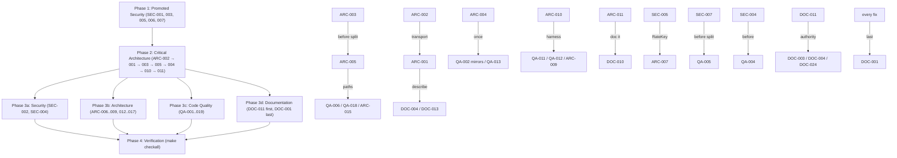

# Project Audit Report

> **Project**: par-rt-db
> **Date**: 2026-08-23
> **Stack**: Rust (axum/tokio/sqlx, Postgres 17) server + CLI, TypeScript client (bun), Rust client, Python client (uv), Swift client, React/Vite dashboard, wire-corpus
> **Audited by**: Claude Code Audit System (`/fable-audit`, four Fable 5 domain agents; HEAD `2609de3`, clean tree; par-mem index at `c48f2e5`, newer commits read directly)

---

## Executive Summary

The single-instance product is in good shape: SQL hygiene, row-auth composition, admin gating, OAuth hardening, the single-writer committer, and the five-implementation wire-corpus all held up under verification, and dependency scans (`cargo audit`, `bun audit`) are clean. The most serious findings are in the just-landed multi-instance mode (ENH-022 Stage 4c): non-owner replicas never invalidate live subscriptions for writes committed on the owner (ARC-001), and forwarded writes ride `pg_notify` whose 8000-byte cap is never checked (ARC-002), so under a load balancer the push-on-change contract silently breaks and ordinary-sized forwarded writes fail. One High security defect (SEC-001, IPv4-mapped IPv6 literals bypass the webhook SSRF denylist) is a one-line fix. Documentation drifted badly over the last two weeks of shipping (Swift client, multi-instance, push-through-committer): the changelog omits ~60 commits, the parity contract under-claims client coverage, and several client README examples do not compile. Remediating the Critical and High set is roughly two to three focused days plus one larger refactor (the Rust core-crate extraction); the wire-corpus and the `TestDb` RAII harness are genuine strengths that make most of this safe to do.

### Issue Count by Severity

| Severity | Architecture | Security | Code Quality | Documentation | Total |
|----------|:-----------:|:--------:|:------------:|:-------------:|:-----:|
| 🔴 Critical | 2 | 0 | 0 | 2 | **4** |
| 🟠 High     | 3 | 1 | 5 | 9 | **18** |
| 🟡 Medium   | 8 | 3 | 7 | 12 | **30** |
| 🔵 Low      | 4 | 3 | 7 | 8 | **22** |
| **Total**   | **17** | **7** | **19** | **31** | **74** |

Dedup notes (same defect found by more than one domain): ARC-304 (committer arm count / multi-instance docs) is recorded as DOC-003 + DOC-004; SEC-009 (pg_notify cap) is recorded as ARC-002; SEC-008 (`expect` in webhook.rs) is recorded under QA-007; ARC-311 (Python admin duplication) is recorded as QA-003; QA-011 (`Config::from_env`) is recorded as ARC-012; the committer.rs half of the code-quality "god module" finding is recorded as ARC-005 (QA-005 keeps `schema.rs` only).

Known work in flight (not re-reported): backlog card "Add Go client library (go-client)".

---

## 🔴 Critical Issues (Resolve Immediately)

### [ARC-001] Non-owner replicas never invalidate live subscriptions for owner-side writes
- **Area**: Architecture (multi-instance only, `RTDB_MULTI_INSTANCE=true`)
- **Location**: `server/src/notify.rs:169` (`run_listener` takes only `op_feed`, no `SubscriptionManager`), `server/src/committer.rs:685-740` (`complete_forwarded_reply` is the only cross-replica fan-out, and only for writes this replica forwarded), `server/src/lib.rs:274-278`, `README.md:1048-1049`
- **Description**: The op-feed NOTIFY listener injects into the op-feed ring only. A write executed on the owner from its own clients, its scheduler/reaper/workflow pollers, a migrate, or a write forwarded from a third replica is never fanned out on replica B, so B's `/sync` subscribers hold stale results until some unrelated write happens to be forwarded from B. The spec (`docs/superpowers/specs/2026-08-22-multi-instance-stage4-design.md:191-194`) acknowledges this only for admin arms.
- **Impact**: The product's core contract (push on change) silently breaks behind a load balancer. Nothing errors; clients stop receiving updates. The subs-verify sampler cannot catch it because it runs only on the replica that executed the write.
- **Remedy**: Carry the `WriteSet` (tables + doc ids; `doc_values` may stay empty so Indexed/Ordered subscriptions degrade to re-run) over the cross-replica channel and call `subs.fan_out` on every non-origin replica with subscriptions for that db. Transport must be decided together with ARC-002. Add a two-replica integration test (subscribe on B, mutate on A directly, assert B pushes). Update README/ARCHITECTURE to state the real guarantee.
- **Effort**: M

### [ARC-002] Forwarded writes and replies ride `pg_notify`, whose 8000-byte payload cap is never checked
- **Area**: Architecture (multi-instance only); also reported by Security as SEC-009
- **Location**: `server/src/forward.rs:206-227` (`Forwarder::forward` serializes a full `ForwardRequest` — up to 1024 txn steps, a whole `SchemaDef`, or a `MigrateRequest` — into one NOTIFY), `server/src/forward.rs:452-460` (reply carries the full `TxnOutcome`)
- **Description**: Postgres rejects NOTIFY payloads of 8000 bytes or more. Any forwarded mutate whose documents exceed roughly 7 KB, any realistic schema push, and any reply with a large `TxnOutcome` fails at `pg_notify`. Request side: `ForwardFail::Notify` → takeover attempt → `CONFLICT` while the owner is alive. Reply side: the owner has already committed but the origin times out and the client sees `CONFLICT` for a committed write. No test in `multi_instance_stage4_test.rs` exercises a large payload; no doc mentions the limit.
- **Impact**: In multi-instance mode, ordinary-sized writes that land on a non-owner fail deterministically, and bulk writes report failure after committing.
- **Remedy**: Spool request and reply bodies in a small `rtdb.forward_queue` table (id, target, kind, payload jsonb, created_at) and put only the row id in the NOTIFY; the listener reads the row. This also gives forwarded writes durability across a listener reconnect and a sweep target. At minimum, add a size guard that returns a clear typed error plus a test.
- **Effort**: M

### [DOC-001] CHANGELOG `[Unreleased]` omits most work since v0.1.0
- **Area**: Documentation
- **Location**: `CHANGELOG.md:15-204`
- **Description**: 72 commits since tag `v0.1.0` (`cc4916d`); Unreleased has 10 entries. Missing: the Swift client (`dcd4139`, `34ef9c2`, `9d7da8e`, `016d34c`, `c28d997`), computed fields (`00c2a7b`..`547de77`), auto-increment (FM-37), multi-instance Stage 4c forwarding (`1136c94`), CSRF self-heal + `DELETE /admin/sessions?expired=true` (`5db04e4`, a new admin route mirrored in clients), `merge_users` stale-row fix (`b79473f`), missing-schema `NOT_FOUND` (`2609de3`, a wire-visible error-code change), push-through-committer (`0af69ec`), idempotent restore (`86405c5`), ts/python 2xx-without-JSON fixes, SEC-207.
- **Impact**: Anyone diffing v0.1.0 against HEAD, or cutting v0.2.0, has no record of shipped behavior changes including an error-code change and a new route.
- **Remedy**: Add Added/Changed/Fixed/Security entries under `[Unreleased]` for each item above. Write it last in the remediation cycle so this cycle's fixes are included once.
- **Effort**: M

### [DOC-002] Client README examples that do not compile or run
- **Area**: Documentation
- **Location**: `ts-client/README.md:36-38`; `rust-client/README.md:185-187, 321-327, 344`; `python-client/README.md:30, 231, 501-503`
- **Description**: ts `:36-38` `.authorize({ field: "userId", eq: "$user" })` — `authorize` takes an op-tagged `FilterExpr` with a `{ $user: true }` marker (`ts-client/src/schema.ts:379-384`, `protocol.ts:631`); lines 87/225 of the same README are correct. rust `:185-187` `WorkflowStepSpec { txn, ... }` — field is `Option<Transaction>` (`rust-client/src/wire.rs:565`). rust `:321-327` passes `build_request().directives` where `migrate_schema` takes `&[Directive]` (`admin/mod.rs:125`) and sets `dry_run` twice. rust `:344` `use par_rt_db_client::UploadResult;` — not re-exported at crate root (`lib.rs:84`). python `:30` lists `OptimisticStore` in `par_rt_db.optimistic` — module exports only `project` (`optimistic.py:47`); the real feature is `RtDbClient(optimistic_updates=True)` (`ws_client.py:231`). python `:231` inserts `{"_id": "i1"}` — `_`-prefixed keys are rejected (`server/src/schema.rs:1485-1486`). python `:501-503` calls `db.push_schema(schema)` on an undefined `db`; the sync signature is `push_schema(db, schema)` (`http_client.py:583`).
- **Impact**: First-contact users copy code that fails; the `_id` and `OptimisticStore` errors teach wrong mental models.
- **Remedy**: Fix each example to the cited signature; for rust either import `par_rt_db_client::http::UploadResult` or add root re-exports for `UploadResult`, `FileMetadata`, `SignedUrl`.
- **Effort**: S

---

## 🟠 High Priority Issues

### [ARC-003] Forward timeout ambiguity can double-execute a mutate; idempotency is opt-in only
- **Area**: Architecture
- **Location**: `server/src/committer.rs:632-669` (`forward_or_takeover` → `takeover_submit` re-submits the original request), `server/src/forward.rs:167-176` (`ForwardFail::Timeout`), `README.md:1057-1059`
- **Description**: If the owner executes and then dies (or replies late), the origin takes the lease and re-executes the same `Transaction`. The dedup table is shared by all replicas, so a key would protect it, but keys are optional and the server has the information to mint one.
- **Impact**: Duplicate inserts / double-applied patches during failover, exactly the window where correctness matters most.
- **Remedy**: In `submit`, when a `Mutate` is about to be forwarded and `idempotency_key` is `None`, mint a UUIDv7 key and thread it through the forward payload and the takeover resubmit. Non-Mutate arms are idempotent by construction.
- **Effort**: S

### [ARC-004] Server and rust-client hand-maintain byte-identical copies of core engine logic and wire types
- **Area**: Architecture
- **Location**: exact duplicates: `server/src/value_expr.rs:469` ↔ `rust-client/src/value_expr.rs:270` (`walk_value_expr_fields`), `server/src/schema.rs:653` ↔ `rust-client/src/schema.rs:166` (`literal_set`), `server/src/txn.rs:1360` ↔ `rust-client/src/in_memory/mod.rs:72` (`worst_case_affected`); near-duplicates: `eval_value_expr` (CC 53 in both `server/src/value_expr.rs:256` and `rust-client/src/in_memory/value_expr.rs:22`), `detect_destructive_changes` (`server/src/ddl.rs:161` / `rust-client/src/in_memory/migrate.rs:618`), `strip_on_delete`, `stamp_computed`, `rename_value_expr_fields`, `validate_value`/`validate_doc`, `apply_patch`; wire enums defined twice (`server/src/dsl.rs:291` `FilterExpr` vs `rust-client/src/wire.rs:903`; `ValueExpr` in both). `server/Cargo.toml:93` already depends on `par-rt-db-client` as a dev-dep.
- **Description**: Cross-language duplication (ts/python/swift) is a deliberate no-codegen design policed by the wire-corpus. Rust-to-Rust duplication inside one workspace is not.
- **Impact**: Every DSL change is a five-way mirror where it could be four; the two Rust copies can drift without the corpus noticing until a case covers the drifted branch.
- **Remedy**: Extract a `par-rt-db-core` workspace crate (wire/DSL types, `ValueExpr`/`FilterExpr` eval and walkers, `validate_value`/`validate_doc`, `apply_patch`, migrate helpers, `worst_case_affected`) with no tokio/sqlx deps; server and rust-client depend on it. Phase it: wire types first, then pure helpers.
- **Effort**: L

### [ARC-005] `committer.rs` is a 2754-line god module: lease, forwarding glue, channel supervision, reclamation, quota warmer, and eight execution arms
- **Area**: Architecture (also Code Quality)
- **Location**: `server/src/committer.rs`: lease 131-186, forward shims 188-338, `Committers` + `channel_for` 340-960, reclaimer 1117-1290, quota warmer 1288-1335, `run_committer` 1336-1518, arms 1586-2754 (`handle_workflow_advance` 1813-2074 CC 38, `handle_reaper` 2104-2264, `handle_merge_users` 2265-2457, `handle_migrate` 2458-2590)
- **Description**: The single-writer invariant is the one thing the project says must never break, and its implementation shares a file with five unrelated concerns. `channel_for` alone handles cache hit, drain-wait, DB-existence check, lease acquisition, task spawn, supervisor spawn, and four poller spawns.
- **Impact**: Highest-risk file to edit; par-mem rates `Committers` blast radius Critical (805 transitive dependents).
- **Remedy**: Split into `committer/{mod.rs (Committers, submit), lease.rs, forwarding.rs, supervisor.rs, arms/{mutate,scheduled,workflow,reaper,merge,migrate,schema}.rs, taps.rs (publish_taps)}`. Pure move, no behavior change; keep `publish_taps` private to the module so the tap invariant stays enforced by visibility. Land ARC-001/002/003 first.
- **Effort**: M

### [SEC-001] Webhook SSRF denylist bypassed by IPv4-mapped IPv6 literals
- **Area**: Security — CWE-918 / OWASP A10
- **Location**: `server/src/webhook.rs:153-164` (`is_blocked_ip`, `IpAddr::V6` arm); consumed at `webhook.rs:294-302` (`validate_webhook_url` IP-literal path) and by `WebhookDnsResolver::resolve` (`webhook.rs:220-247`)
- **Description**: The V6 arm checks loopback, unspecified, link-local, multicast and ULA but never calls `to_ipv4_mapped()`. `::ffff:127.0.0.1` and `::ffff:169.254.169.254` pass. The `url` crate hands `[::ffff:a.b.c.d]` to the validator as `Host::Ipv6`, so it takes the literal path and is admitted; the connect-time resolver uses the same function, so a DNS answer of a mapped address is also missed. Dual-stack kernels route a mapped address to the IPv4 target.
- **Impact**: An admin-token holder registers `https://[::ffff:169.254.169.254]/latest/meta-data/...` and webhook delivery reaches cloud metadata or loopback services. Blind SSRF (response bodies are not returned), but request bodies and headers are attacker-shaped.
- **Remedy**: First line of the V6 arm: `if let Some(v4) = v.to_ipv4_mapped() { return is_blocked_ip(IpAddr::V4(v4)); }` (also handle the deprecated `to_ipv4()` compat form). Unit tests for both literals returning `true`.
- **Effort**: S

### [QA-001] `apply_schema_additive` is a 340-line, CC 57 function with 8 levels of nesting
- **Area**: Code Quality
- **Location**: `server/src/ddl.rs:391-732`
- **Description**: par-mem's most complex function in the repo (CC 57) and hotspot #2. One loop body handles CREATE TABLE, ALTER ADD COLUMN + backfill, soft-delete column, computed-field backfill, and index creation.
- **Impact**: Every schema feature lands as another branch inside this loop; changes touch the DDL invariants and are hard to review.
- **Remedy**: Extract `create_table_ddl(table) -> String`, `add_missing_columns(tx, old, new)`, `backfill_computed(tx, old, new)`, `create_indexes(tx, old, new)`; keep `apply_schema_additive` as the ordered driver. Covered by `server/tests/schema_*` and the wire-corpus.
- **Effort**: M

### [QA-002] `validate_one` (migrate directives) is CC 55 and hotspot #1
- **Area**: Code Quality
- **Location**: `server/src/migrate.rs:190-416`; mirrored in `rust-client/src/in_memory/migrate.rs:1013` (CC 32), `ts-client/src/in_memory/migrate.ts:153` (CC 33), `swift-client/Sources/ParRtDbClient/InMemoryMigrate.swift`
- **Description**: Single `match` over every `Directive` variant. The `RenameField` arm rewrites indexes, owner/collaborator/auto-increment fields, `authorize`, defaults, and computed expressions inline; seven name-bearing surfaces must each be remembered.
- **Impact**: A missed surface is a silent migration bug.
- **Remedy**: One function per directive and a single `rename_field_refs(table, from, to)` helper that owns the list of name-bearing surfaces (server first; mirror the helper shape in the three engines, with a corpus case per surface).
- **Effort**: M

### [QA-003] Python client duplicates its API surface by hand (sync/async twins, admin ops three to five times)
- **Area**: Code Quality (also Architecture ARC-311)
- **Location**: `python-client/src/par_rt_db/admin.py:946-2323` (`RtDbAdminClient` vs `AsyncRtDbAdminClient`, 69 method names duplicated), `http_client.py` vs `aio_http_client.py` (56/57 mirrored; `http_client.py:591,685,708,721` and `aio_http_client.py:484,579,602,617` re-implement `mint_token`, `ops_recent`, `admin_mutate`, `migrate_schema`); exact 30-line duplicate `transform_url` at `aio_http_client.py:425` / `http_client.py:532`
- **Description**: `admin.py` already has an `_AdminRequest` builder (line 138) with `_SyncAdminExecutor`/`_AsyncAdminExecutor` (895/918); the HTTP clients do not use it. No `unasync` or codegen step.
- **Impact**: Every server change costs four Python edits; sync/async drift is invisible to the wire-corpus (it exercises the in-memory engine, not these transports).
- **Remedy**: Hoist `transform_url` to a shared module (S). Route `RtDbHttpClient`/`AsyncRtDbHttpClient` admin methods through the `_op_*` builders, then generate sync/async pairs from one table or adopt `unasync`.
- **Effort**: L

### [QA-004] Six OAuth providers each hand-roll `complete_login` with three divergent user-upsert semantics
- **Area**: Code Quality
- **Location**: `server/src/auth/apple.rs:98`, `github.rs:62`, `gitlab.rs:64`, `google.rs:67`, `microsoft.rs:134`, `oidc.rs:76`; email-keyed `INSERT ... ON CONFLICT (email) DO UPDATE SET login` copy-pasted at `google.rs:98`, `gitlab.rs:96`, `oidc.rs:106`; GitHub uses `upsert_user` keyed on `github_id`; Microsoft links by `microsoft_sub`
- **Description**: `provider.rs` centralizes begin/callback/poll and `oidc_exchange_and_fetch_userinfo` (line 162); the remaining duplication is identity resolution.
- **Impact**: Identity linking differs per provider in ways not obviously intentional (a returning Google user whose email changed becomes a new account; GitHub handles it). Any fix must be remembered six times.
- **Remedy**: One `resolve_user(pool, ProviderIdentity { provider_id_column, provider_id, login, email })` in `auth/mod.rs` all six call; per-provider code keeps token exchange and claim parsing.
- **Effort**: M

### [QA-005] `schema.rs` (3850 lines, 60% inline tests) mixes types, validation, filter checking, computed inference, and value validation
- **Area**: Code Quality
- **Location**: `server/src/schema.rs` (`impl TableDef` 677-1235, `mod tests` 1515-3850)
- **Description**: Every feature touches this file; its size makes review hard. (The committer.rs half of this finding is ARC-005.)
- **Remedy**: `schema/{mod,types,validate,computed,value}.rs` with tests moved to per-submodule `tests.rs`. Pure move.
- **Effort**: L

### [DOC-003] ARCHITECTURE.md / CONTRIBUTING.md committer arm enumeration is off by one
- **Area**: Documentation (also Architecture ARC-304)
- **Location**: `docs/ARCHITECTURE.md:44-59, 143, 614-621`; `CONTRIBUTING.md:259-261`
- **Description**: Both say "seven `handle_*` arms" call `publish_taps`; `server/src/committer.rs` has eight — `handle_push_schema` (`committer.rs:2591`, source `"push"`, `docop_taps=false`, added in `0af69ec`) is missing from the diagram, the tap list, and the "third committer request arm" sentence.
- **Impact**: CLAUDE.md names this list as the invariant to maintain when adding write paths; it is wrong.
- **Remedy**: Change to eight; add `handle_push_schema` with its tap semantics to both docs.
- **Effort**: S

### [DOC-004] Multi-instance coordination (ENH-022 Stages 2–4c) is absent from ARCHITECTURE.md; README files it under "limitations"; SPEC_STATUS lacks the spec
- **Area**: Documentation (also Architecture ARC-304)
- **Location**: `docs/ARCHITECTURE.md:69, 260, 392-400`; `README.md:1039-1060, 1114`; `docs/superpowers/SPEC_STATUS.md`; `CLAUDE.md` invariants list
- **Description**: ARCHITECTURE has only a diagram edge label for `pg_notify`; nothing on the advisory-lock lease (`committer.rs:128-178`), shadow committers replying CONFLICT (`:184-215`), forwarding over `rtdb_write_fwd`/`rtdb_write_replies` (`forward.rs:59-373`), takeover on timeout (`committer.rs:626-670`), `rtdb_auth.rate_counters` (`rate_limit.rs:73,159-206`), or presence gossip. README documents the shipped feature under "Known MVP limitations" and its roadmap bullet at 1114 still lists forwarding as remaining work. SPEC_STATUS omits `2026-08-22-multi-instance-stage4-design.md`, `2026-08-18-swift-client-design.md`, `2026-08-21-workflow-await-signal-design.md`.
- **Impact**: The internals doc contributors are told to read first does not describe a correctness-relevant subsystem.
- **Remedy**: Add a "Multi-instance coordination" section + ToC entry + `rate_counters` to the table diagram; add the shadow/lease invariant to CLAUDE.md; promote the README section out of "limitations" and delete the stale roadmap bullet; add the three specs to SPEC_STATUS. Write after ARC-001/002/003 land so it describes corrected behavior.
- **Effort**: M

### [DOC-005] FEATURE_MATRIX §4 and many rows contradict shipped state
- **Area**: Documentation
- **Location**: `FEATURE_MATRIX.md:3, 44, 45, 63, 66, 70, 73, 77, 81, 85, 86, 88, 155-158, 179-181, 260, 383`
- **Description**: §4 says "single-writer on one server instance … horizontal scale-out is a deliberate non-goal" while line 107 and `forward.rs` describe multi-replica operation. Rows 44, 45, 63, 66, 70, 73, 77, 81, 85, 86, 88 say "three clients"/"ts/rust/python"/"ts+rust" where all four SDKs implement the symbol. Counts: "53 cases" (260/383) vs 82 files in `wire-corpus/semantics/`; "59"/"64" admin methods (44) vs 67+; §7 "original 21 plus #22" vs 39 rows; header "last updated 2026-08-16" while rows cite 2026-08-22. Row 27 is absent though FM-27 is referenced at line 88 and `CHANGELOG.md:415`.
- **Impact**: The parity contract under-claims coverage and sends implementers to build what exists.
- **Remedy**: Rewrite §4; sweep client-coverage phrases to "all four"; replace hard counts with directory references or recompute; add a #27 stub; bump the date.
- **Effort**: M

### [DOC-006] `docs/clients.md`, `docs/README.md`, `server/README.md` predate the Swift client
- **Area**: Documentation
- **Location**: `docs/clients.md:3, 12-16, 32, 40-44, 48, 52`; `docs/README.md:9, 12, 39`; `server/README.md` opening paragraph
- **Description**: "three client SDKs", no Swift row/column, "three in-memory engines"; `clients.md:32` marks TypeScript optimistic updates "—" though `ts-client/src/optimistic.ts` exists; `docs/README.md` says six packages and omits `swift-client/README.md`.
- **Remedy**: Add Swift row/column (WS, HTTP, admin, in-memory, optimistic, `ParRtDbUI`), fix counts to four/five/seven, flip the TS optimistic cell, add the swift README link.
- **Effort**: S

### [DOC-007] WS presence wire frame documented under the wrong tag
- **Area**: Documentation
- **Location**: `README.md:959-960`
- **Description**: Says client frames are `presence` / `updatePresence` / `leavePresence` with a `presenceOk` reply. `server/src/protocol.rs:94-99` tags the client frame `presenceState` (with `ttlMs`); `ServerMessage` has `presenceSnapshot`/`presenceErr`, no `presenceOk`.
- **Impact**: A hand-rolled client sends a frame the server rejects.
- **Remedy**: Correct the frame names and add `ttlMs`.
- **Effort**: S

### [DOC-008] Dashboard README describes the pre-cookie auth model
- **Area**: Documentation
- **Location**: `dashboard/README.md:72-73, 83-88, 103`
- **Description**: Claims the admin bearer rides `Sec-WebSocket-Protocol` and lives only in React state; code uses an HttpOnly `rtdb_session` cookie, `/auth/me` on mount, and a CSRF header (`dashboard/src/lib/session.tsx:27-43`, `admin.tsx:49,107-110`). Says admin-key mode polls every ~2 s; `useLiveTable.ts:22-30,95-101` uses `/admin/stream` and polls only while the stream is down.
- **Remedy**: Rewrite both paragraphs around the cookie/CSRF model and op-feed refresh.
- **Effort**: S

### [DOC-009] Install instructions imply registry availability that does not exist
- **Area**: Documentation
- **Location**: `ts-client/README.md:8-12`; `rust-client/README.md:92`; `python-client/README.md:46-63`; `swift-client/README.md:39-43`
- **Description**: `bun add @par-rt-db/client`, `par-rt-db-client = "0.1"`, `pip install par-rt-db` — `docs/RELEASING.md:8-11` states nothing is published and CI publishes nothing. Swift README says `.package(url:)` lands "when swift-client gets its own tag" while RELEASING says consumers pin the repo tag; neither works (no root `Package.swift`).
- **Impact**: Every install path a new user tries fails.
- **Remedy**: Each README states "not yet published" and shows the path/git/workspace install; reconcile Swift wording with RELEASING. (Manifest `publish = false` / `private` guards are an optional code change.)
- **Effort**: S

### [DOC-010] Dockerfile `[[test]]` stub-list trap undocumented
- **Area**: Documentation (code-side fix is ARC-011)
- **Location**: missing from `deploy/README.md` Troubleshooting and `CONTRIBUTING.md` invariants
- **Description**: `Dockerfile:26-35` must `touch` a placeholder for every `[[test]]` in `rust-client/Cargo.toml`; a new test breaks `make deploy` only (`c48f2e5`). No doc mentions it.
- **Remedy**: One bullet in both docs (or, once ARC-011 lands, a bullet describing the generated stub list / gate).
- **Effort**: S

### [DOC-011] The 2026-07-21 spec is called "authoritative" while it disclaims that and is stale
- **Area**: Documentation
- **Location**: `docs/ARCHITECTURE.md:7-11`; `CLAUDE.md` ("Authoritative sources"); `PRODUCT.md:59`; `docs/superpowers/specs/2026-07-21-par-rt-db-design.md:4, 24, 56, 96, 287, 329-332, 352-353`
- **Description**: The spec's own line 4 says code and FEATURE_MATRIX are authoritative. Its content says "all 26 rows" (39 now), optimistic "three SDKs", "shipped: GitHub + Google" (six providers), "multi-node → non-goal" (shipped), Traefik topology (actually Cloudflare tunnel + compose), `client/` package path (`ts-client/`).
- **Impact**: Agents told to "read the spec before changing protocol" get contradicted guidance.
- **Remedy**: Demote the spec to historical record in ARCHITECTURE/CLAUDE/PRODUCT, point at README + FEATURE_MATRIX + wire-corpus; add a "superseded" note at the spec top. Decide this before DOC-003/004/024.
- **Effort**: S

---

## 🟡 Medium Priority Issues

### Architecture

- **[ARC-006] Cross-replica op-feed emits one `pg_notify` round trip per DocOp inside the serialized committer turn** — `server/src/notify.rs:104-152` (`publish_ops` loops `SELECT pg_notify` per op), called from `committer.rs:1538-1548`. A 1000-row `deleteByQuery` or TTL sweep issues 1000+ sequential round trips while holding the db's write turn. Remedy: batch ops into one payload per (db, source) chunked under the 8000-byte cap, or move the notify off the turn (spawn after reply, like the quota refresh at `committer.rs:1570-1583`). Effort: S.
- **[ARC-007] Multi-instance rate limiting adds a synchronous UPSERT round trip to every request** — `server/src/rate_limit.rs:191-227` (`check_pg`), from `check_http_rate_limits` (:262) and `ws.rs:499`. Remedy: local token bucket per key with periodic reconciliation to the shared table, or documented approximate budgets; keep exact path opt-in. Effort: M.
- **[ARC-008] Forward listener spawns an unbounded task per forwarded request** — `server/src/forward.rs:434-483`. Remedy: bound with a `Semaphore` (`RTDB_FORWARD_CONCURRENCY`) and reply with a typed `RATE_LIMITED` when saturated. Effort: S.
- **[ARC-009] `AppState::new` is a constructor with I/O side effects and fire-and-forget tasks** — `server/src/lib.rs:177-341` spawns idle reclaimer, presence flush, three `PgListener` loops, rate sweep; nothing joins or cancels them; `main.rs` graceful shutdown stops axum only; 15 `test_state_*` variants (`server/tests/common/mod.rs:112-320`) each spawn listeners against the shared dev Postgres. Remedy: return a `BackgroundTasks` struct (or take a `CancellationToken`); `main.rs` cancels after `with_graceful_shutdown`; tests get `Drop` teardown. Effort: M.
- **[ARC-010] Test suite is 55 separately linked integration binaries sharing one Postgres** — `server/tests/*.rs`, `docker-compose.dev.yml` `max_connections=300`, ci.yml "~20 concurrent test binaries". Remedy: one `tests/main.rs` with `mod` per file, one shared pool via `OnceCell`, per-test db isolation unchanged. Effort: M.
- **[ARC-011] Dockerfile dependency layer hand-enumerates rust-client test stubs** — `Dockerfile:26-35`. Remedy: `cargo chef`, or generate the stub list from the manifest in the Dockerfile, or add a `dockerfile-stub-check` to `checkall`. Effort: S.
- **[ARC-012] Flat 90-field `Config` with a 220-line, highest-churn `from_env`** — `server/src/config.rs:43-350`, `:763-986` (CC 22, churn 6/60 days; also QA-011). Remedy: keep the `*Env` helpers but store them as nested sub-structs (`config.oauth.github`, `config.limits`, `config.multi_instance`); split `HotConfig` into its own module; finish the table-driven `env_u64`-style helpers. Effort: M.
- **[ARC-013] No protocol version negotiation across five wire implementations** — `server/src/protocol.rs` (no version in WS `Auth` or HTTP), `deny_unknown_fields` rejects a one-field-ahead client with a generic 400. Remedy: `protocolVersion` in `Auth`/`Authed` and an `X-Rtdb-Protocol` header with a typed `UNSUPPORTED_PROTOCOL` error; mirror in four clients + corpus case. Effort: S (server) + mirrors.

### Security

- **[SEC-002] Internal error text leaks to clients from `quota::measure` and image transforms** — CWE-209. `server/src/quota.rs:82` (`internal(format!("measure db storage: {e}"))` on a sqlx error); `server/src/image_transform.rs:200,215,220` (`TransformError::Internal(e.to_string())` from `image::ImageError`) surfaced verbatim at `:415-417`; `error.rs:143-156` serializes `message` unchanged. Reachable on unauthenticated `GET /storage/{id}?w=…` and on quota-enabled uploads. Remedy: `tracing::error!` the detail, return fixed text. The other `internal(format!(..{e}))` sites swept (`webhook.rs:375,538`, `committer.rs:2518`, `schema_history.rs:68`, `snapshot.rs:53,78`, `pagination.rs:13`, `scheduler.rs:211,214`, `workflows.rs:667`, `forward.rs:357`, `admin/dbs.rs:134`) are serde/encode errors and are fine. Effort: S.
- **[SEC-003] Signed storage URL does not bind the transform parameters** — CWE-863. `server/src/signed_url.rs:35-40` (HMAC over `"{id}.{exp_ms}"`); `http_api.rs:853-900` verifies id+exp then passes the whole query map to `TransformParams::parse`. One leaked signed URL authorizes unbounded distinct renders (each a fresh decode/resize/encode and `moka` entry). Remedy: include a canonicalized transform string (or its hash) in the HMAC message; or document and make the storage rate limit mandatory when signed URLs are required. Invalidates pre-deploy URLs; check all four clients for a local signer before shipping. Effort: M.
- **[SEC-004] Apple id_token signature not verified (documented accepted risk)** — CWE-347. `server/src/auth/apple.rs:232-296` checks `iss`/`aud`/`exp` only; Microsoft (`auth/microsoft.rs:457-470`) does full JWKS + RS256. Remedy: fetch Apple JWKS and verify ES256, reusing the Microsoft JWKS cache pattern. Effort: M.

### Code Quality

- **[QA-006] Scheduler/workflow status writes are fire-and-forget without logging** — `server/src/committer.rs:1678, 1695, 1765-1794, 1821` (`let _ = scheduler::mark_error(...)`, `let _ = workflows::mark_failed(...)`), `:1581` (`let _ = quotas.refresh(...)`); `scheduler.rs:437` `mark_error` does not log. A job that failed and could not be marked stays `pending` and refires, with nothing in logs. Remedy: `if let Err(e) = … { tracing::warn!(db, id, error = %e, …) }` at each site, or make `mark_error` log internally. Effort: S.
- **[QA-007] Seven `unwrap`/`expect` outside `#[cfg(test)]` contradict the stated invariant** — `server/src/backup.rs:135`, `http_api.rs:1234` (`.expect("matched above")` after `.any()` then `.find()`), `webhook.rs:311` (also SEC-008), `auth/cookie.rs:69, 118, 210`. No `clippy::unwrap_used` lint configured, so the count drifts. Remedy: fix the avoidable sites (`find` once and match; `DateTime::UNIX_EPOCH`; `LazyLock<HeaderValue>` cookie templates; `unwrap_or(443)`), then add `#![cfg_attr(not(test), deny(clippy::unwrap_used, clippy::expect_used))]` to `server/src/lib.rs` with justified `#[allow]`s, or amend CLAUDE.md to "no unwrap/expect on fallible paths". Effort: S.
- **[QA-008] 14 dashboard pages hand-roll load/loading/error instead of using `useAsync`** — `dashboard/src/pages/{Audit,Admins,Config,Backups,Db,QueryConsole,ScheduledJobs,Storage,SchemaHistory,Schema,Tokens,Workflows,Subscriptions,Webhooks}Page.tsx`; `dashboard/src/lib/useAsync.ts` used by 2 pages. Remedy: migrate pages to `useAsync` (or a `useAdminQuery(client, fetcher, deps)` variant handling the `if (!db) return` guard). Effort: M.
- **[QA-009] Client-side message dispatchers are 150–300-line functions** — `rust-client/src/ws.rs:1197-1482` (`run_session`, CC 34, 9 params behind `#[allow(clippy::too_many_arguments)]`) and `:1616-1762` (`apply_server_message`, CC 34); `ts-client/src/client.ts` `handleMessage` (CC 27); `swift-client/.../WsClient.swift:1417` `route` (CC 31). Remedy: `PendingQueues { mutate, schedule, workflow }` over a generic `Pending<R>`, per-family handlers. Land before the Go client starts so it copies the better shape. Effort: M.
- **[QA-010] 12 production `#[allow(clippy::too_many_arguments)]` / `type_complexity` sites** — `server/src/subs.rs:1042`, `audit.rs:82`, `webhook.rs:691`, `migrate.rs:1002, 1116`, `txn.rs:758, 1998`, `auth/provider.rs:161`, `query/terminals.rs:676, 713, 807`, `workflows.rs:219, 688, 756`, `rust-client/src/ws.rs:1196`. Remedy: `TxnCtx`/`QueryCtx` parameter structs (`PrincipalCtx` already shows the pattern). Effort: M.
- **[QA-011] Sleep-based timing in 24 test files** — `server/tests/workflows_test.rs` (5), `ttl_test.rs` (5), `scheduled_test.rs` (4), `presence_xreplica_test.rs` (3), `webhook_test.rs`, `notify_test.rs`, `mutation_dedup_test.rs`, `query_test.rs` (2 each); `ts-client/tests/client.test.ts` (5), `react.test.tsx` (4). Remedy: a `wait_until(deadline, || async { pred })` helper in `server/tests/common/mod.rs` (Python already has this shape at `test_presence.py:224`). Effort: M.
- **[QA-012] `server/tests/common/mod.rs` carries 27 per-function `#[allow(dead_code)]`** — `:98-579`; same in `rust-client/tests/common/mod.rs:7, 34, 75`. Remedy: `#![allow(dead_code)]` at the top, or promote helpers to `server/src/test_support.rs` behind a `test-support` feature (ARC-010 makes this moot for server). Effort: S.

### Documentation

- **[DOC-012] Gate and test-target descriptions omit real stages** — `README.md:218, 984, 993, 1018`; `CLAUDE.md:25`; `CONTRIBUTING.md:79-85, 101`; `server/README.md` Develop block; `ts-client/README.md:537, 542`. `Makefile:200` `checkall` = `env-drift-check cli-docs-check fmt-check lint typecheck test rust-client-check-features`; docs never name `cli-docs-check` or `rust-client-check-features`; `make test` also runs cli and swift; "six packages" vs seven. Remedy: one canonical gate table in README; others point at it; "six" → "seven". Effort: S.
- **[DOC-013] CHANGELOG Stage 4 entry contradicts Stage 4c; other CHANGELOG errors** — `CHANGELOG.md:29-41` (says forwarding is "the staged follow-up"), `:640` (`clone-db` "schema-only" — `admin/dbs.rs:177-200` clones the full snapshot), `:747` (links `rust-client/src/admin.rs`, now `admin/mod.rs`); ad-hoc `### Feature:`/`### Fix:` headings vs the Keep-a-Changelog claim; breaking changes inline bold only (145, 471). Remedy: rewrite the Stage 4 entry, fix wording/link, regroup with a Breaking subsection. Effort: M.
- **[DOC-014] Undocumented public surface in client READMEs** — ts (`vectorSearch`/`hybridSearch`, range bounds, `idempotencyKey`, most txn steps, `Migration.*`, React auth components, admin schema history/backups/webhooks/audit/`explainQuery`, `RtDbError`, cursor helpers); rust (presence, optimistic updates, `Config`/`ConnectionState`/`Subscription`, admin `explain_query`/webhooks/audit/sessions/`merge_users`/backups/`clone_db`); python (presence, data-plane storage, `batch_query`, `find_one_by_index`/`upsert_by_index`, schedule pause/resume, admin sessions/audit/history, 16 `__all__` names); swift (`batchQuery`, `findOneByIndex`/`upsertByIndex`, `status()`/`WsState`, `LiveQuery.start/stop`, cursor helpers, admin `dbStats`/`listSubscriptions`, in-memory example). Remedy: "Full API" section per README mirroring FEATURE_MATRIX rows. Effort: M each.
- **[DOC-015] rust-client `cargo doc` fails and crate docs lag the README** — `rust-client/src/admin/mod.rs:166, 501, 578`, `in_memory/value_expr.rs:20` (four broken intra-doc links, exit 101 under `warnings = "deny"`); `lib.rs:15-31` omits `RtDbAdminClient`, `hybrid_search`, `fields`, `distinct`, `aggregate`, `batch_query`, `upload_stream`, signed URLs, says "third/fourth" client; `README.md:18` cites `src/admin.rs`, `:103-104` leak rustdoc `#` markers. Remedy: fix links; add `cargo doc --no-deps --all-features` to `rust-client-check-features` (code change); update `lib.rs` docs; fix README. Effort: S.
- **[DOC-016] ts-client `StepInsertResult`/patch docstring wrong; TS/python docstring gaps and style claims** — `ts-client/src/mutation.ts:42` says patch returns `{ id }` (returns `null`); `client.ts:245-321`, `query.ts:26-197`, `migration.ts:30-67,110`, `admin.ts:517-570`, `react.tsx:86,163,269-282` undocumented (~72% coverage); `python-client/README.md:67-70` claims Google-style docstrings (8 of 492 comply, no `D` ruff rules); `wire.py:73-88, 731` (`AfterMs/RunAt/Cron/Interval`, `PresenceMember`) no docstring; `__init__.py:3-5` "fourth client". Remedy: fix the docstring; document the listed TS symbols; soften the Python claim or enable `convention = "google"`; fix "fourth". Effort: M.
- **[DOC-017] Swift docs: stale counts and doc-comment gaps** — `swift-client/README.md:353, 440, 449, 485` ("387 tests in 26 suites" vs 494/31; "53 cases" vs 82; `.cast(value:, to: .toString)` invalid — real is `cast(value:to:)`, `Migrate.swift:56`); `Wire.swift:61-67` 18% documented, `Transport.swift:28-99` public methods undocumented, `Errors.swift:33-38`. Remedy: replace counts with "every case in `wire-corpus/semantics/`"; fix the cast prose; document transport/wire types. Effort: S/M.
- **[DOC-018] Operational gaps in deploy/README.md and root Configuration table** — `deploy/README.md:35-39, 58-61, 274-301, 344-345` (never mentions `RTDB_TRUSTED_PROXY` — code default `false` at `config.rs:889`, `.env.example:122`/compose set `true`, required behind the tunnel — or `RTDB_COOKIE_SECURE`; never names `DEPLOY_HOST`/`DEPLOY_PATH`; manual rsync `--exclude` vs `make deploy`'s `--filter=':- .gitignore'` at `Makefile:209`; 344-345 points at CLAUDE.md for backup semantics that live in `config.rs:596-605`); `README.md:403-433` table has 26 of 88 vars, missing `RTDB_INSTANCE_ID`, `RTDB_MULTI_INSTANCE`, `RTDB_FORWARD_TIMEOUT_MS` (100 ms floor), `RTDB_TRUSTED_PROXY`, `RTDB_COOKIE_SECURE`, `RTDB_POOL_MAX_CONNECTIONS`, `RTDB_ADMIN_EMAILS`, `RTDB_BACKUP_*`; `server/README.md` claims every knob it names has a row (false for `RTDB_RATE_LIMIT_*`, `RTDB_IMAGE_*`, `RTDB_PRESENCE_*`); README:406 calls `.env.example` "the full list" though it lacks `RTDB_DATABASE_URL`/`RTDB_PORT`. Remedy: as listed. Effort: M.
- **[DOC-019] `env-drift-check` does not check what README/CONTRIBUTING say it checks** — `README.md:1010`; `scripts/env-drift-check.sh:41-45, 61` greps only `std::env::var(`, so 50+ knobs read via `env_parsed`/`env_bool` (`config.rs:351,371`) are invisible. No live drift today. Remedy: widen the grep to `(std::env::var|env_parsed|env_bool)\("RTDB_` and fix the comment (script change), or narrow the doc claim. Effort: S.
- **[DOC-020] Broken or ambiguous file references (verified on disk)** — `README.md:236` `static/privacy.html` → `server/src/static/privacy.html`; `docs/RELEASING.md:43` `deploy/README.md` → `../deploy/README.md`; `deploy/README.md:17` anchor `#tracing-opentelemetry--otel-enh-018` → `#tracing-opentelemetry--otlp-enh-018`; `FEATURE_MATRIX.md:73` `src/in_memory.ts` → `ts-client/src/in_memory/index.ts`, `src/in_memory/tests.rs` → `rust-client/src/in_memory/tests/`, line 72 brace-glob; `docs/ARCHITECTURE.md:240, 414` and `PRODUCT.md:61` `query.rs` → `server/src/query/`; `docs/fable/ENH-023-behavioral-semantics-corpus.md:17` (`in_memory.ts`/`in_memory.py` are directories now); `docs/fable/ENH-025-generated-cli-reference.md:8` (`tests/cli/skill-sync.test.ts` lives in the kanban repo); `dashboard/README.md:47-48` "server `CLAUDE.md`" (does not exist); `docs/ARCHITECTURE.md` 24 bare `.rs` refs (e.g. 488, 629, 645, 667), `server/README.md:29-33`, `CHANGELOG.md:629, 716` need a "paths relative to `server/src/`" sentence. Effort: S.
- **[DOC-021] server/README.md stale on scheduling kinds and layout table** — Scheduling says `when` is one-shot or cron only (`ScheduleWhen::Interval`/`everyMs` exists, `protocol.rs:255-270`); Layout row points SPA serving at `src/static/` (serving is `lib.rs:609-624`); no `forward.rs` row. Effort: S.
- **[DOC-022] README WS section omits the per-connection frame-rate close** — `README.md:459, 530-560`: `RATE_LIMITED` row says the WS stays open, but `ws.rs:37-38, 351-354` closes after 200 frames/10 s; `MAX_FRAME_BYTES` close and codes 4400/4401 (`ws.rs:56-59`) undocumented. Effort: S.
- **[DOC-023] CONTRIBUTING troubleshooting stale on test-db cleanup** — `CONTRIBUTING.md:221-226` says tests "don't drop" their databases and cleanup covers only `db_t*`; `server/tests/common/mod.rs:420,468` `TestDb` drops on `Drop`, `scripts/dev-db-clean.sql:20-24` also sweeps `sc_*`. Effort: S.

---

## 🔵 Low Priority / Improvements

### Architecture

- **[ARC-014] Makefile drives the three Rust crates per-directory instead of as a workspace** — `Makefile:31-60`; `cargo fmt --all` / `cargo clippy --workspace --all-targets --all-features` from root is one invocation; `.pre-commit-config.yaml:14-25` runs the full multi-language `make fmt`/`make lint` on any Rust change. Effort: S.
- **[ARC-015] `channel_for` drain-wait is a 2 ms sleep-poll loop with a 5 s deadline** — `server/src/committer.rs:811-822`. A `Notify` on supervisor exit removes the poll. Effort: S.
- **[ARC-016] `execute_as_owner` TOCTOU on `is_owner`** — `server/src/forward.rs:275-280`: losing the lease between the check and `submit_owned` returns the shadow's `CONFLICT` as a reply, so the origin surfaces CONFLICT instead of taking over. Document or map that error to "drop silently". Effort: S.
- **[ARC-017] `RtDbError` code enum is a sixth hand-mirrored surface** — in-degree 281 server / 87 rust-client / 91 ts / 84 python / 105 swift. Add a wire-corpus case enumerating all codes. Effort: S.

### Security

- **[SEC-005] One shared per-IP rate bucket across admin login, anonymous mint and public storage** — CWE-770. `server/src/rate_limit.rs:50-54` (`RateKey::Ip` has no route namespace), `:97-135`; callers `admin/login.rs:52` (10 rpm), `auth/provider.rs:882` (10 rpm), `rate_limit.rs:295` (storage, 600 rpm). Eleven public storage fetches from one IP lock `/admin/login` for the rest of the minute from that IP/NAT. Remedy: add a route discriminator to the key (`RateKey::Ip { route, ip }` or separate variants); update the `("ip", ip)` mapping in `check_pg` at `:200`. Effort: S.
- **[SEC-006] `/admin/stream` never re-validates the admin credential after handshake** — CWE-613. `server/src/admin/observability.rs:220-252`. Remedy: on the existing 1 s gauge tick, re-run `authenticate_admin`/`session_still_valid` and close on failure. Effort: S.
- **[SEC-007] Filter DSL has no explicit depth or `In`-array cap (defense in depth)** — CWE-674. `server/src/dsl.rs:291`, `query/filter.rs:114-206`, `:152-172`, `schema.rs:486`, `query/search.rs:123-126`. Verified not exploitable today (serde_json 128-level limit in force, WS frames capped at 64 KB → ≤ ~64 levels). Remedy: shared pre-check (depth ≤ 32, `In` length ≤ 1000, `search.query` ≤ 4 KB) returning `BAD_REQUEST`. Effort: S.

### Code Quality

- **[QA-013] Exact duplicates within a single package** — `rust-client/src/admin/mod.rs:1343` vs `rust-client/src/http.rs:841` (`error_response` + `json_result`, 20 lines); `ts-client/src/in_memory/store.ts:546` vs `ts-client/src/optimistic.ts:51` (`canonical()`, 12 lines). Hoist to `rust-client/src/http_common.rs` and `ts-client/src/canonical.ts`. Effort: S.
- **[QA-014] Stale header comment in the TS in-memory engine** — `ts-client/src/in_memory/store.ts:19-23` claims gaps are marked `TODO`; there are none and the engine runs all 82 corpus cases. Effort: S.
- **[QA-015] `SchemaDefinition<any>` in 10 exported TS signatures** — `ts-client/src/schema.ts:625, 627, 630, 635, 650, 660`, `ts-client/src/admin.ts:422, 527, 537`. `export type AnySchema = SchemaDefinition<Record<string, TableDefinition>>`. Effort: S.
- **[QA-016] Dead test helper** — `server/src/subs.rs:1315` `#[allow(dead_code)] fn _unused_vector_spec()`. Delete. Effort: S.
- **[QA-017] sqlx error text formatted into the storage stream error** — `server/src/storage.rs:523, 543` (`std::io::Error::other(format!("{e:?}"))`). Hyper aborts the body so it never reaches the client, but log it and send fixed text. Effort: S.
- **[QA-018] Inline duration literals on committer/rate-limit paths** — `server/src/committer.rs:775` (5 s), `:812` (2 ms), `:1135` (60 s), `server/src/rate_limit.rs:179` (60 s), `server/src/admin/observability.rs:276` (1 s). Name them. Effort: S.
- **[QA-019] CLI has no integration tests** — `cli/` (1858 LOC, 5 inline test modules, no `cli/tests/`). `assert_cmd` tests against an env-gated live server. Effort: M.

### Documentation

- **[DOC-024] ARCHITECTURE.md coverage gaps** — no presence section (`server/src/presence.rs`), no wire-corpus mention in "Wire contract and clients" (584-607), no admin-CSRF/self-heal (`admin/mod.rs:161`), anon-auth cross-ref at 484 points to matrix #20 instead of #35; no sequence diagram for write/forward paths; single-sentence paragraphs (392-400, 550-570). Effort: S each.
- **[DOC-025] No TOC on the four client READMEs** — all exceed the style-guide threshold. Effort: S.
- **[DOC-026] Internal tracking ids in reader-facing prose** — `ts-client/README.md:44, 48, 56, 66, 150, 324, 395, 476`. Effort: S.
- **[DOC-027] wire-corpus/README.md nits** — `:100` stray comma; `:193-194` "bump the runner count assertion" is stale (all runners enumerate the directory); `wire-corpus/golden-vector.json:2` `$comment` says three engines / four implementations. Effort: S.
- **[DOC-028] python README minor** — `:297, 355, 526` cite `par_rt_db/schema.py` (under `src/`); `:26, 61, 238` present `[aio]` as a separate extra (aliases `[http]`, `pyproject.toml:14`); `pip install par-rt-db[http]` needs quotes under zsh. Effort: S.
- **[DOC-029] OAUTH_SETUP.md and runbook structure** — omits `RTDB_SESSION_TTL_DAYS` (30), `RTDB_ANONYMOUS_SESSION_TTL_DAYS` (1), `RTDB_COOKIE_SECURE`, and a "disable a provider" rollback note; `deploy/README.md` lacks a summary sentence after the H1. Effort: S.
- **[DOC-030] Undocumented make targets** — `python-client-fmt/lint/typecheck`, `rust-client-check-features`, all `swift-client-*` granular targets. Effort: S.
- **[DOC-031] Go client mentioned only in a spec** — `docs/superpowers/specs/2026-08-18-swift-client-design.md:286`; if in flight, add a planned row to FEATURE_MATRIX §7 / `docs/clients.md`. Effort: S.

---

## Detailed Findings

### Architecture & Design

Grounding: par-mem `get_repository_stats` (568 files, 18.4k symbols, 84 communities), `find_central_symbols`/`find_bridge_symbols` (`RtDbError` is the articulation point in every package; `rust-client::http`, `Committers`, `PrincipalCtx`, `ApiJson` are the server-side hubs), `find_most_complex_functions`, `get_impact(execute_txn)` (3 callers, all in `committer.rs`), `wc -l` for file sizes (`find_god_objects` timed out). The four post-index commits were read directly.

Findings ARC-001..ARC-017 above. ARC-304 (docs) is recorded as DOC-003/DOC-004; ARC-311 as QA-003; the dashboard-state observation (single `AdminProvider` context + per-page state, 20 s poll) needs no action at current size.

Health: Good (single-instance) / Fair (multi-instance mode as shipped). The Stage 4 lease design (advisory lock on the same backend that performs the writes) makes split-brain impossible by construction; the remaining defects are in the reactive contract and payload transport.

### Security Assessment

Four area reviews (SQL/DSL compiler, auth/admin/WS, storage/webhooks/forwarding/backup, dashboard/clients/config). The fourth had not returned when the report was compiled; that area was covered by the lead's direct spot-checks (secret grep, TLS-disable grep, `lib.rs` header layer, dashboard storage sinks, CI pinning, Dockerfile/compose), not a file-by-file review. Every finding was verified by reading the code path.

Dependency scans: `cargo audit` (395 crates) clean; `bun audit` clean for `dashboard/` and `ts-client/`; `pip-audit` could not run in the sandbox but `python-client/uv.lock` pins current releases (pydantic 2.13.4, httpx 0.28.1, websockets 17.0.1, h11 0.16.0, certifi 2026.7.22).

Findings SEC-001..SEC-007 above. Rejected after verification: "rate limiting is per-instance in-memory under multi-instance" (stale — `lib.rs:369` wires `RateLimiter::new_pg` when `RTDB_MULTI_INSTANCE=true`); "unbounded `FilterExpr` recursion crashes the process" (downgraded to SEC-007).

Verified strengths: identifier hygiene and `$n` binding across `ddl.rs`/`query/`; row-auth predicates composed on every multi-row read/write path (`query/terminals.rs:342-386`, `compile_scan_where`) with an equivalent single-id check in `txn.rs:1183-1330`; router-level admin middleware with constant-time compare; 256-bit `OsRng` secrets stored as sha256; OAuth single-use state, login-CSRF double-submit, `email_verified` required, RS256 pinned with `kty: RSA` filtering; strict CORS allowlist with no Origin reflection; security-header layer; storage content-type allowlist with HTML/SVG forced to `octet-stream` + `attachment`; webhooks with `redirect::Policy::none()`, connect-time DNS re-check, HMAC signatures; backups chmod 0600, `PG*` env credentials, restore into a fresh database; forwarding rides `pg_notify` so the inter-instance trust boundary is Postgres credentials; no committed secrets, no TLS-verify disables, Actions pinned, Dockerfile runs as `USER rtdb`, compose binds `127.0.0.1:8300`, dashboard keeps no credentials in `localStorage`.

### Code Quality

Grounding: par-mem `find_hotspots` (60-day window), `find_most_complex_functions`, `find_duplicate_code`, `find_dead_code` (all 60 candidates verified as false positives — public SDK API, lazy-import hook, pydantic serializer, `useSession()` consumers), grep sweeps across all seven packages, direct reads of the top hotspots and the three unindexed commits (clean).

Findings QA-001..QA-019 above. Technical debt summary: 0 TODO/FIXME in source; 15 production Rust `#[allow]` (12 `too_many_arguments`/`type_complexity`, 4 `should_implement_trait` in `rust-client/src/value_expr.rs:171-207`, 1 dead_code), 37 in test code; 12 `biome-ignore` (all justified); 11 `# type: ignore` + 2 `noqa` (all in Python tests, documented). 62 files > 500 lines; largest: `server/src/schema.rs` 3850, `rust-client/src/ws.rs` 2935, `python-client/.../in_memory/store.py` 2759, `server/src/committer.rs` 2754, `ts-client/src/in_memory/store.ts` 2720, `swift-client/.../InMemoryEngine.swift` 2556, `rust-client/src/wire.rs` 2547, `server/src/migrate.rs` 2422, `server/src/txn.rs` 2378, `python-client/.../admin.py` 2323.

Test coverage: 182 test files; test LOC (~116k) is 83% of source LOC (~139k); server and the four clients estimated > 70%; dashboard moderate; CLI low. The wire-corpus (82 semantics cases + golden vectors) runs against all five engines. Key untested: `cli/` end-to-end, `server/src/admin/observability.rs` (456 lines, no dedicated test), Python sync/async twin drift.

Verified strengths: 17 `ServerMessage` and 17 `ClientMessage` variants match exactly across all five wire files; every `fetch_one` inspected is a COUNT/EXISTS/RETURNING/nextval that cannot miss; every broad `except Exception` in the Python client is commented and logs via `logger.exception`; the `let _ = reply.send(...)` pattern (34 sites) is correct; Swift uses `[weak self]` consistently, no force unwraps/`try!`.

### Documentation Review

Grounding: five parallel reviewers (README/server/CLAUDE; ARCHITECTURE/DESIGN/PRODUCT/clients; FEATURE_MATRIX/CHANGELOG/RELEASING/CONTRIBUTING; four client READMEs + cli/dashboard/wire-corpus + docstrings; deploy/OAuth/env/Makefile), `find_broken_doc_links` (355 rows, filtered to the real breaks in DOC-020), the CLI reference regenerated into scratch and diffed (no drift), `swift test list`, route-by-route verification of the README HTTP/WS tables against the router.

Findings DOC-001..DOC-031 above.

Inventory: README Good (structure complete; accuracy defects DOC-007/012/018/020/022); API docs Present for server (route tables, error codes, hot-config names, DSL examples all verified exact), Partial for clients (DOC-014); Architecture Partial (DOC-003/004/011/024); Changelog stale (DOC-001/013); Contributing Good (DOC-012/023); Deploy/Ops Good with gaps (DOC-010/018); Troubleshooting present in three places, missing the stub-list trap, the oauth_test PoolTimedOut flake, suite-hang-is-pool-contention, `make -C <root>` after `cd`, `RTDB_TRUSTED_PROXY` behind a tunnel; Generated CLI reference current; Docstrings: rust-client ~100% (`missing_docs` under deny), python 95% quantity / inconsistent style, ts ~72%, swift 73%.

Verified strengths: `.env.example` (85 vars) and `docker-compose.yml` complete against all 88 `RTDB_*` literals; `cli/README.md` generated and drift-gated; `docs/OAUTH_SETUP.md` callback paths, scopes, cookie attributes and error behaviors match code for all six providers; CONTRIBUTING's mirror-all-clients and corpus-authoring rules match `wire-corpus/README.md`.

---

## Remediation Roadmap

### Immediate Actions (Before Next Deployment)
1. SEC-001 — IPv4-mapped IPv6 SSRF bypass (one line + tests).
2. ARC-002 then ARC-001 then ARC-003 — make multi-instance forwarding correct (payload transport, cross-replica subscription invalidation, server-minted idempotency keys). Until these land, run production single-instance or document the gap.
3. SEC-002 — stop leaking sqlx/image error text.
4. DOC-002, DOC-007, DOC-009 — fix the README examples, the presence frame names, and the install instructions that fail on first contact.

### Short-term (Next 1–2 Sprints)
1. ARC-005 committer split, then QA-001/QA-002/QA-004 (schema/migrate/OAuth consolidation) and QA-006/QA-007.
2. SEC-003, SEC-004, SEC-005, SEC-006, SEC-007 hardening.
3. DOC-001, DOC-003, DOC-004, DOC-005, DOC-006, DOC-008, DOC-010, DOC-011, DOC-012, DOC-013 — bring the changelog, parity contract, architecture doc and docs index up to HEAD.
4. ARC-011 (Dockerfile stubs), ARC-008 (forward back-pressure), ARC-006 (op-feed notify batching), QA-008/QA-009/QA-011/QA-012.

### Long-term (Backlog)
1. ARC-004 core-crate extraction; QA-003 Python sync/async generation; QA-005 `schema.rs` split.
2. ARC-010 single test binary; ARC-009 background-task lifecycle; ARC-012 nested config; ARC-013 protocol versioning; ARC-007 local token buckets.
3. Remaining Low items and DOC-014..DOC-031.
4. Enhancements ENH-028..ENH-033 (see `docs/fable/` and the board).

---

## Positive Highlights

1. The single-writer committer with `publish_taps` as one enforcement point, pollers that only enqueue, and a Stage 4 ownership lease held on the same Postgres backend that performs the writes — split-brain is impossible by construction, not by fencing.
2. The wire-corpus (golden vectors + 82 behavioral-semantics cases + wire-shape checks) runs against the server and all four in-memory engines, and the 17/17 `ClientMessage`/`ServerMessage` variant parity across five wire files held under inspection.
3. SQL hygiene is real: every physical identifier derives from a validated grammar, every value is bound, 63-byte truncation collisions are detected at push time, and search `regconfig` is never client-supplied.
4. Row-level auth predicates are composed on every multi-row read and write path, including all three search terminals and `patchByQuery`/`deleteByQuery`.
5. Hot config as `Arc<ArcSwap<HotConfig>>` with per-request CORS evaluation, plus the `env-drift-check` and `cli-docs-check` gates, turn configuration drift into a build failure.
6. Test discipline: per-test databases with RAII cleanup, opt-in live tests, a feature-combination gate for rust-client, and a macOS CI job so Swift is never silently skipped; test LOC is 83% of source LOC.
7. `.env.example` and `docker-compose.yml` are complete against all 88 `RTDB_*` knobs; OAUTH_SETUP.md matches code line-for-line for six providers; the README route tables verified exact against the router.
8. Dependency posture is clean (`cargo audit`, `bun audit`), Actions are pinned, the container runs unprivileged, and there are no committed secrets or TLS-verification bypasses.

---

## Audit Confidence

| Area | Files Reviewed | Confidence |
|------|---------------|-----------|
| Architecture | ~40 (server core, forward/notify/committer, manifests, Makefile, Dockerfile, tests/common) + graph analytics | High |
| Security | ~35 (auth/, admin/, ws, http_api, query/, ddl, storage, webhook, signed_url, forward, backup, rate_limit, lib) + dependency scans | High for server; Medium for dashboard/clients/config (spot-checked, not file-by-file) |
| Code Quality | ~60 across seven packages + graph analytics | High |
| Documentation | 40+ docs and READMEs, route-by-route and symbol-by-symbol verification | High |

*The dashboard/client-side security surface (token handling in the four SDKs, dashboard CSP/CSRF details) was spot-checked only and may benefit from a targeted manual review.*

---

## Remediation Plan

> This section is generated by the audit and consumed directly by `/fix-audit`.
> It pre-computes phase assignments and file conflicts so the fix orchestrator
> can proceed without re-analyzing the codebase. Per-issue execution detail is in
> `AUDIT-REMEDIATION-PLAN.md`, ordered to match these phases.

### Phase Assignments

#### Phase 1 — Critical Security (Sequential, Blocking)
<!-- No Critical security issues this cycle. Rows below are Security issues PROMOTED here because they modify files also targeted by Code Quality (keeps the conflict out of parallel execution). -->
| ID | Title | File(s) | Severity |
|----|-------|---------|----------|
| SEC-001 | IPv4-mapped IPv6 SSRF bypass in `is_blocked_ip` | `server/src/webhook.rs` | High |
| SEC-003 | Signed URL does not bind transform params | `server/src/signed_url.rs`, `server/src/http_api.rs` | Medium |
| SEC-005 | Route-namespace the per-IP rate bucket | `server/src/rate_limit.rs`, `server/src/admin/login.rs`, `server/src/auth/provider.rs` | Low |
| SEC-006 | Re-validate admin credential on `/admin/stream` tick | `server/src/admin/observability.rs` | Low |
| SEC-007 | Explicit filter depth / `In` / search-query caps | `server/src/dsl.rs`, `server/src/query/filter.rs`, `server/src/query/search.rs`, `server/src/schema.rs` | Low |

#### Phase 2 — Critical Architecture (Sequential, Blocking)
<!-- Order matters: ARC-002 decides the transport ARC-001 uses; ARC-003 is a small edit that must land before the ARC-005 file split; ARC-004 blocks the two-copy complexity fixes; ARC-010 blocks test-file additions; ARC-011 blocks DOC-010. -->
| ID | Title | File(s) | Severity | Blocks |
|----|-------|---------|----------|--------|
| ARC-002 | Spool forwarded requests/replies; enforce the `pg_notify` cap | `server/src/forward.rs`, `server/src/db.rs`, `server/tests/multi_instance_stage4_test.rs` | Critical | ARC-001, DOC-004 |
| ARC-001 | Cross-replica subscription invalidation for owner-side writes | `server/src/notify.rs`, `server/src/committer.rs`, `server/src/lib.rs`, `server/src/subs.rs` | Critical | DOC-004 |
| ARC-003 | Server-minted idempotency key on forwarded mutates | `server/src/committer.rs`, `server/src/forward.rs` | High | ARC-005 |
| ARC-005 | Split `committer.rs` into a module | `server/src/committer.rs` → `server/src/committer/**` | High | QA-006, QA-018, ARC-015 |
| ARC-004 | Extract `par-rt-db-core` crate (wire types + pure engine helpers) | `Cargo.toml`, `core/`, `server/src/{value_expr,schema,txn,ddl,dsl,migrate}.rs`, `rust-client/src/{value_expr,schema,wire}.rs`, `rust-client/src/in_memory/**` | High | QA-002 (engine mirrors), QA-013 |
| ARC-010 | Consolidate server integration tests into one binary | `server/tests/main.rs`, `server/tests/*.rs`, `server/tests/common/mod.rs`, `docker-compose.dev.yml`, `.github/workflows/ci.yml` | Medium | QA-011, QA-012, ARC-009 |
| ARC-011 | Generate/gate the Dockerfile rust-client test stub list | `Dockerfile`, `Makefile`, `scripts/` | Medium | DOC-010 |

#### Phase 3 — Parallel Execution

**3a — Security (remaining)**
| ID | Title | File(s) | Severity |
|----|-------|---------|----------|
| SEC-002 | Generic messages for quota measure and image transform errors | `server/src/quota.rs`, `server/src/image_transform.rs` | Medium |
| SEC-004 | Verify Apple id_token ES256 signature via JWKS | `server/src/auth/apple.rs`, `server/src/auth/microsoft.rs` (reuse) | Medium |

**3b — Architecture (remaining)**
| ID | Title | File(s) | Severity |
|----|-------|---------|----------|
| ARC-006 | Batch / off-turn cross-replica op-feed notify | `server/src/notify.rs`, `server/src/committer/**` | Medium |
| ARC-007 | Local token bucket with periodic PG reconciliation | `server/src/rate_limit.rs`, `server/src/lib.rs`, `.env.example`, `docker-compose.yml` | Medium |
| ARC-008 | Bound forward-listener concurrency | `server/src/forward.rs`, `server/src/config.rs`, `.env.example`, `docker-compose.yml` | Medium |
| ARC-009 | `BackgroundTasks` handle + cancellation on shutdown | `server/src/lib.rs`, `server/src/main.rs`, `server/tests/common/mod.rs` | Medium |
| ARC-012 | Nested `Config` sub-structs; table-driven `from_env` | `server/src/config.rs` + consumers | Medium |
| ARC-013 | Protocol version negotiation | `server/src/protocol.rs`, `server/src/ws.rs`, `server/src/http_api.rs`, `server/src/error.rs`, four client wire files, `wire-corpus/` | Medium |
| ARC-014 | Workspace-level cargo invocations in Makefile | `Makefile`, `.pre-commit-config.yaml` | Low |
| ARC-015 | Replace drain sleep-poll with `Notify` | `server/src/committer/supervisor.rs` | Low |
| ARC-016 | Handle `is_owner` TOCTOU in `execute_as_owner` | `server/src/forward.rs` | Low |
| ARC-017 | Wire-corpus case enumerating error codes | `wire-corpus/`, five error files | Low |

**3c — Code Quality (all)**
| ID | Title | File(s) | Severity |
|----|-------|---------|----------|
| QA-001 | Decompose `apply_schema_additive` | `server/src/ddl.rs` | High |
| QA-002 | Per-directive functions + `rename_field_refs` | `server/src/migrate.rs`, three engine mirrors, `wire-corpus/semantics/` | High |
| QA-003 | De-duplicate Python sync/async and admin ops | `python-client/src/par_rt_db/{admin,http_client,aio_http_client}.py` | High |
| QA-004 | Single `resolve_user` for OAuth providers | `server/src/auth/{mod,apple,github,gitlab,google,microsoft,oidc}.rs` | High |
| QA-005 | Split `schema.rs` into a module | `server/src/schema.rs` → `server/src/schema/**` | High |
| QA-006 | Log fire-and-forget status-write failures | `server/src/committer/**`, `server/src/scheduler.rs` | Medium |
| QA-007 | Remove avoidable unwrap/expect; gate the invariant | `server/src/{backup,http_api,webhook,lib}.rs`, `server/src/auth/cookie.rs`, `CLAUDE.md` | Medium |
| QA-008 | Migrate dashboard pages to `useAsync` | `dashboard/src/pages/*.tsx`, `dashboard/src/lib/useAsync.ts` | Medium |
| QA-009 | `PendingQueues` in client dispatchers | `rust-client/src/ws.rs`, `ts-client/src/client.ts`, `swift-client/.../WsClient.swift` | Medium |
| QA-010 | `TxnCtx`/`QueryCtx` parameter structs | `server/src/{subs,audit,webhook,migrate,txn,workflows}.rs`, `server/src/auth/provider.rs`, `server/src/query/terminals.rs` | Medium |
| QA-011 | `wait_until` helper replacing fixed sleeps | `server/tests/common/mod.rs`, listed server/ts test files | Medium |
| QA-012 | Module-level `allow(dead_code)` in test common | `server/tests/common/mod.rs`, `rust-client/tests/common/mod.rs` | Medium |
| QA-013 | Hoist in-package exact duplicates | `rust-client/src/{admin/mod,http}.rs`, `ts-client/src/{in_memory/store,optimistic}.ts` | Low |
| QA-014 | Fix stale TS in-memory header comment | `ts-client/src/in_memory/store.ts` | Low |
| QA-015 | `AnySchema` alias | `ts-client/src/{schema,admin}.ts` | Low |
| QA-016 | Delete `_unused_vector_spec` | `server/src/subs.rs` | Low |
| QA-017 | Generic storage stream error | `server/src/storage.rs` | Low |
| QA-018 | Name inline durations | `server/src/committer/**`, `server/src/rate_limit.rs`, `server/src/admin/observability.rs` | Low |
| QA-019 | CLI integration tests | `cli/tests/`, `cli/Cargo.toml`, `Dockerfile` (stub list) | Low |

**3d — Documentation (all)**
| ID | Title | File(s) | Severity |
|----|-------|---------|----------|
| DOC-011 | Demote the 2026-07-21 spec | `docs/ARCHITECTURE.md`, `CLAUDE.md`, `PRODUCT.md`, `docs/superpowers/specs/2026-07-21-par-rt-db-design.md` | High |
| DOC-002 | Fix non-compiling client README examples | `ts-client/README.md`, `rust-client/README.md`, `rust-client/src/lib.rs`, `python-client/README.md` | Critical |
| DOC-003 | Eight committer arms | `docs/ARCHITECTURE.md`, `CONTRIBUTING.md` | High |
| DOC-004 | Multi-instance section; README promotion; SPEC_STATUS | `docs/ARCHITECTURE.md`, `README.md`, `CLAUDE.md`, `docs/superpowers/SPEC_STATUS.md` | High |
| DOC-005 | FEATURE_MATRIX §4 and coverage rows | `FEATURE_MATRIX.md` | High |
| DOC-006 | Swift in clients.md / docs index / server README | `docs/clients.md`, `docs/README.md`, `server/README.md` | High |
| DOC-007 | Presence frame names | `README.md` | High |
| DOC-008 | Dashboard auth model | `dashboard/README.md` | High |
| DOC-009 | Install instructions | four client READMEs, `docs/RELEASING.md` | High |
| DOC-010 | Document the Dockerfile stub-list trap | `deploy/README.md`, `CONTRIBUTING.md` | High |
| DOC-012 | Canonical gate table | `README.md`, `CLAUDE.md`, `CONTRIBUTING.md`, `server/README.md`, `ts-client/README.md` | Medium |
| DOC-013 | CHANGELOG corrections and format | `CHANGELOG.md` | Medium |
| DOC-014 | Full API sections in client READMEs | four client READMEs | Medium |
| DOC-015 | rust-client `cargo doc` + crate docs | `rust-client/src/{admin/mod,in_memory/value_expr,lib}.rs`, `rust-client/README.md`, `Makefile` | Medium |
| DOC-016 | ts/python docstrings | `ts-client/src/*.ts(x)`, `python-client/README.md`, `python-client/src/par_rt_db/{__init__,wire}.py` | Medium |
| DOC-017 | Swift README counts + doc comments | `swift-client/README.md`, `swift-client/Sources/ParRtDbClient/{Wire,Transport,Errors}.swift` | Medium |
| DOC-018 | Ops config docs | `deploy/README.md`, `README.md`, `server/README.md` | Medium |
| DOC-019 | env-drift-check scope | `scripts/env-drift-check.sh`, `README.md` | Medium |
| DOC-020 | Broken file references | as listed | Medium |
| DOC-021 | server/README scheduling + layout | `server/README.md` | Medium |
| DOC-022 | WS frame-rate close | `README.md` | Medium |
| DOC-023 | CONTRIBUTING test-db cleanup | `CONTRIBUTING.md` | Medium |
| DOC-024..031 | Low items | as listed | Low |
| DOC-001 | CHANGELOG `[Unreleased]` (write LAST) | `CHANGELOG.md` | Critical |

### File Conflict Map
<!-- Files touched by issues in multiple domains. Fix agents must read current file state before editing — a prior agent may have already changed these. -->

| File | Domains | Issues | Risk |
|------|---------|--------|------|
| `server/src/committer.rs` (→ `committer/**` after ARC-005) | Architecture + Code Quality | ARC-001, ARC-003, ARC-005, ARC-006, ARC-015, QA-006, QA-018 | ⚠️ ARC-005 moves the file; QA-006/QA-018/ARC-015 must target the split paths |
| `server/src/forward.rs` | Architecture + Security | ARC-002, ARC-003, ARC-008, ARC-016 (SEC-009 merged) | ⚠️ Read before edit |
| `server/src/webhook.rs` | Security + Code Quality | SEC-001, QA-007, QA-010 | ⚠️ Read before edit |
| `server/src/http_api.rs` | Security + Code Quality + Architecture | SEC-003, QA-007, ARC-013 | ⚠️ Read before edit |
| `server/src/rate_limit.rs` | Security + Architecture + Code Quality | SEC-005, ARC-007, QA-018 | ⚠️ SEC-005 changes `RateKey`; ARC-007 rewrites `check` |
| `server/src/admin/observability.rs` | Security + Code Quality | SEC-006, QA-018 | ⚠️ Read before edit |
| `server/src/schema.rs` (→ `schema/**` after QA-005) | Security + Code Quality + Architecture | SEC-007, QA-005, ARC-004 | ⚠️ SEC-007 first; ARC-004 moves helpers out; QA-005 last |
| `server/src/auth/provider.rs` | Security + Code Quality | SEC-005, QA-004, QA-010 | ⚠️ Read before edit |
| `server/src/lib.rs` | Architecture + Code Quality | ARC-001, ARC-007, ARC-009, QA-007 | ⚠️ Read before edit |
| `server/src/config.rs` | Architecture (+ QA-011 merged) | ARC-008, ARC-012 | ⚠️ ARC-012 restructures; ARC-008 adds a knob |
| `server/src/migrate.rs` | Architecture + Code Quality | ARC-004, QA-002, QA-010 | ⚠️ ARC-004 may move helpers; read before edit |
| `server/src/txn.rs`, `server/src/ddl.rs`, `server/src/value_expr.rs`, `server/src/dsl.rs` | Architecture + Code Quality + Security | ARC-004, QA-001, QA-010, SEC-007 | ⚠️ ARC-004 extraction first |
| `rust-client/src/ws.rs` | Code Quality | QA-009, QA-010 | ⚠️ Same agent, sequence |
| `rust-client/src/lib.rs` | Documentation | DOC-002, DOC-015 | ⚠️ Read before edit |
| `server/tests/common/mod.rs` | Architecture + Code Quality | ARC-009, ARC-010, QA-011, QA-012 | ⚠️ ARC-010 restructures first |
| `Dockerfile` | Architecture + Code Quality | ARC-011, QA-019 | ⚠️ ARC-011 first |
| `Makefile` | Architecture + Documentation | ARC-011, ARC-014, DOC-015, DOC-030 | ⚠️ Read before edit |
| `.env.example`, `docker-compose.yml` | Architecture | ARC-007, ARC-008 | ⚠️ env-drift-check gate |
| `README.md` | Architecture + Documentation | ARC-001/002/003 (guarantee text), DOC-004/007/012/018/019/020/022 | ⚠️ Docs agent writes after Phase 2 |
| `docs/ARCHITECTURE.md` | Documentation | DOC-003, DOC-004, DOC-011, DOC-020, DOC-024 | ⚠️ DOC-011 first |
| `CLAUDE.md` | Code Quality + Documentation | QA-007, DOC-004, DOC-011, DOC-012 | ⚠️ Read before edit |
| `CHANGELOG.md` | Documentation | DOC-001, DOC-013, DOC-020 | ⚠️ DOC-001 last |
| `CONTRIBUTING.md` | Documentation | DOC-003, DOC-010, DOC-012, DOC-023 | ⚠️ Read before edit |
| `wire-corpus/` | Architecture + Code Quality + Documentation | ARC-013, ARC-017, QA-002, DOC-027 | ⚠️ Corpus additions from three agents |

### Blocking Relationships
- ARC-002 → ARC-001: the cross-replica `WriteSet` fan-out must use the transport ARC-002 chooses (spool table vs. NOTIFY chunking) or it hits the same 8000-byte cap.
- ARC-003 → ARC-005: mint the idempotency key in the current `committer.rs` before the file is split, so the small edit is not re-targeted.
- ARC-001, ARC-002, ARC-003 → ARC-005: land the surgical multi-instance fixes before the pure-move split.
- ARC-005 → QA-006, QA-018, ARC-015, ARC-006: line-targeted committer edits are invalidated by the move; target `server/src/committer/**`.
- ARC-004 → QA-002 (engine-mirror half), QA-013: fix complexity once in the extracted crate rather than in two copies.
- ARC-010 → QA-011, QA-012, ARC-009: test harness restructuring changes `tests/common/mod.rs` and the binary layout.
- ARC-011 → DOC-010: document the generated stub list / gate rather than the hand-maintained trap.
- ARC-011 → QA-019: a new `cli/tests/` target must not re-break the Dockerfile stub list.
- SEC-005 → ARC-007: `RateKey` gains a route discriminator before the local-bucket rewrite.
- SEC-007 → QA-005: add the caps to `schema.rs` before it is split.
- SEC-003 → client mirrors: any SDK that mints signatures locally must change with the HMAC message.
- QA-004 → (after) SEC-004: Apple signature verification lands before the six-provider `resolve_user` consolidation so it is applied once.
- QA-009 → Go client card: land the `PendingQueues` shape before `go-client` copies the nine-parameter one.
- DOC-011 → DOC-003, DOC-004, DOC-024: decide which document is authoritative before writing into it.
- ARC-001, ARC-002, ARC-003 → DOC-004, DOC-013: the multi-instance section and changelog must describe corrected behavior.
- DOC-015 (cargo doc gate), DOC-019 (drift-check grep) are script/build edits; land them before the corresponding doc-claim fixes.
- All fixes → DOC-001: the CHANGELOG `[Unreleased]` rewrite is written last so this cycle's fixes appear once.

### Dependency Diagram

