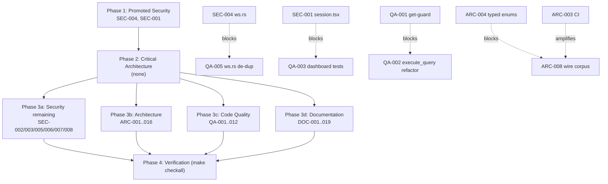

# Project Audit Report

> **Project**: par-rt-db
> **Date**: 2026-07-25
> **Stack**: Rust (axum/tokio + Postgres 17) server; TypeScript client SDK (`@par-rt-db/client`); Rust client crate (`par-rt-db-client`); Python client (`par-rt-db`); React+Vite operator dashboard. Five packages, four wire-contract clients.
> **Audited by**: Claude Code Audit System (four specialized subagents over the par-mem code graph)

---

## Executive Summary

par-rt-db is a genuinely well-engineered codebase. The correctness-critical core is exemplary: the single-writer committer invariant holds structurally (verified via graph impact — `execute_txn` is called only from `handle_mutate`/`handle_scheduled`), SQL-injection defenses are deep (every identifier regex-validated then double-quoted; every value `$n`-bound), per-row `ownerField` authorization is enforced end-to-end without a seam, the admin-key compare is constant-time, and error envelopes never leak Postgres text. **There are zero Critical security or architecture findings.**

The most important issue is **DOC-001**: the root README explicitly claims session-token expiry is *not* enforced on open WebSocket connections, when in fact `authorize` rejects expired sessions on every Subscribe/Mutate — a security-affecting documentation contradiction that can lead operators to under-trust revocation. The highest-leverage *code* cluster is the four-clients-one-wire-contract debt: the Python client shipped to production but is absent from `FEATURE_MATRIX.md`, `CLAUDE.md`, and the root README, and a real silent drift already exists in the TS in-memory client's `get`-combination guard (QA-001). The primary *scalability* concern is a single global `Mutex` in `SubscriptionManager` that collapses the per-database committer isolation into one serialization point (ARC-001).

Estimated effort to remediate the top issues is low (DOC-001 is a one-paragraph fix; QA-001 is a few-line guard; ARC-001 is a contained sharding refactor). The two most structurally valuable investments are adding CI on `make checkall` (ARC-003) and a cross-client wire-parity corpus (ARC-008) — together they make the load-bearing invariants self-enforcing instead of convention-enforced.

**One strength worth leading with**: `FEATURE_MATRIX.md` is a living, ranked, dated, per-client feature-parity contract — the single best piece of documentation in the repo and the model for how multi-client parity should be tracked.

### Issue Count by Severity

| Severity | Architecture | Security | Code Quality | Documentation | Total |
|----------|:-----------:|:--------:|:------------:|:-------------:|:-----:|
| 🔴 Critical | 0 | 0 | 0 | 2 | **2** |
| 🟠 High     | 3 | 0 | 3 | 7 | **13** |
| 🟡 Medium   | 6 | 5 | 5 | 7 | **23** |
| 🔵 Low      | 7 | 3 | 4 | 3 | **17** |
| **Total**   | **16** | **8** | **12** | **19** | **55** |

> Several findings overlap across agents (the same root cause surfaced independently). These cross-references are noted inline and consolidated in the Remediation Plan: **ARC-004 ≡ ARC-009 ≡ QA-008** (stringly-typed protocol enums); **ARC-005 ≡ QA-006** (dead `AdminPrincipal::User` payload); **DOC-002 ≡ DOC-012 ≡ QA-007** (Python client shipped, docs still say three/four clients).

---

## 🔴 Critical Issues (Resolve Immediately)

### [DOC-001] README falsely claims session-token expiry is not enforced on open WebSocket connections
- **Area**: Documentation (security-affecting)
- **Location**: `README.md:329–334` ("Known MVP limitations", first bullet)
- **Description**: The README states a session that expires or is logged out mid-connection "keeps its open WebSocket connection working until the client disconnects," and that session-token expiry "is not" enforced live. This is directly contradicted by `server/src/auth/mod.rs:93–96` (rejects with `UNAUTHORIZED("session expired")` when `*expires_at < now_ms()` inside `authorize`), by `CLAUDE.md` ("session expiry take effect on open connections"), and by `FEATURE_MATRIX.md` row #8 (✅ shipped). The "deferred to Plan 2" parenthetical is also stale — Plan 2 landed.
- **Impact**: Operators reading the README believe revoking a user's session leaves them live on an open WS indefinitely, and may compensate with manual disconnects, reboots, or by avoiding session revocation as a control. It also breaks the project's own "single source of truth" contract for `FEATURE_MATRIX.md`.
- **Remedy**: Delete or invert the bullet to document actual behavior: `authorize` runs on every Subscribe/Mutate over the open WS and rejects expired sessions with `UNAUTHORIZED`, leaving the connection usable for retry with a fresh token. Cross-link to FEATURE_MATRIX #8. Strike the "deferred to Plan 2" wording.

### [DOC-002] Python client (shipped) is undocumented and absent from all contract docs
- **Area**: Documentation
- **Location**: `python-client/README.md` (4 lines), `python-client/src/par_rt_db/__init__.py` (empty — no re-exports), `server/README.md:11` ("two client SDKs"), `FEATURE_MATRIX.md` §5 / rows #11, #15 ("three clients"); no mention in root `README.md`
- **Description**: `python-client/` is a real package (~1,432 LOC across 6 modules + 7 test files, including a `test_wire_parity.py` oracle) wired into the root `Makefile` (`make checkall` runs it), with the full DSL recently landed (`feat(python-client): mutation DSL`). Yet its README is 4 lines with no install/usage/examples, its `__init__.py` exports nothing (so `import par_rt_db` exposes nothing), the root README omits it, `server/README.md` says "two client SDKs," and `FEATURE_MATRIX.md` still says "three clients" three times. The python-client design spec itself calls Python "the fourth implementation of the wire contract."
- **Impact**: A Python user cannot install or use the SDK from docs alone. The FEATURE_MATRIX undercount guarantees the next parity row will forget to mirror to Python — silently breaking the "single wire contract across N clients" invariant the matrix exists to protect. (Same root as DOC-012 and QA-007.)
- **Remedy**: (1) Rewrite `python-client/README.md` mirroring `rust-client/README.md` (install, status/features, ≥2 quick-start examples, dev commands). (2) Add `__init__.py` re-exports (`Mutation`, `Transaction`, `StepResult`, `SchemaDef`, `TableDef`, `t`, `Query`, `TableQuery`, `Order`, `Paginated`, `FilterExpr`, `encode_cursor`, `decode_cursor`, `RtDbError`, `ErrorCode`). (3) Global s/three clients/four clients/ in `FEATURE_MATRIX.md` and s/two/three/ in `server/README.md`. (4) Add a "Clients" section to the root README pointing at all four clients + dashboard.

---

## 🟠 High Priority Issues

### Architecture

#### [ARC-001] `SubscriptionManager` uses one global `Mutex` for all databases, held across Postgres re-runs
- **Area**: Architecture
- **Location**: `server/src/subs.rs:65, 140–147`
- **Description**: `subs: Mutex<HashMap<String, DbSubs>>` is a single lock for every database. `fan_out` (line 147) acquires it, then holds it across each affected subscription's `execute_query` call (line 169) — a Postgres round-trip. Every per-db committer task shares this lock via `Arc<SubscriptionManager>` (`committer.rs:58,213`). The same lock also covers `register`, `remove`/`remove_conn` (WS disconnect teardown), and `count` (`/admin/metrics`).
- **Impact**: At modest multi-tenant scale the per-db committer isolation collapses into one global serialization point. A slow re-run in db A stalls every other db's writes (which need `fan_out` after commit), every new subscribe, every disconnect cleanup, and every metrics snapshot.
- **Remedy**: Shard by db — `HashMap<String, Arc<Mutex<DbSubs>>>` (or `DashMap`). `fan_out` locks only the target db's `Arc<Mutex<DbSubs>>`; the outer map lock is held only long enough to clone/insert the `Arc`. The per-db serialization guarantee is unchanged (`fan_out` is still called only from the per-db committer). `count` becomes a per-shard lock+sum.

#### [ARC-002] Postgres pool size is hardcoded to 10 and not env-configurable
- **Area**: Architecture
- **Location**: `server/src/main.rs:17`
- **Description**: `PgPoolOptions::new().max_connections(10)` — the ceiling is a literal. With one committer task per database (each calling `pool.begin()` plus `execute_query` under `fan_out`), 11+ active databases or one db running many subscription re-runs can exhaust the pool. No env override exists.
- **Impact**: Pool saturation queues/times out requests; the bottleneck is invisible to operators, who can't raise it without a code change and recompile.
- **Remedy**: Add `RTDB_POOL_MAX_CONNECTIONS` to `Config::from_env` (`config.rs`) with a multi-tenant default (50–100); bind at pool construction. Consider `min_connections` and an `acquire_timeout` (current default 30s becomes a long stall under exhaustion).

#### [ARC-003] No CI — the `make checkall` gate depends entirely on developer discipline
- **Area**: Architecture
- **Location**: `.github/workflows/` (absent)
- **Description**: `make checkall` runs fmt-check + clippy `-D warnings` + typecheck + tests across five packages and five toolchains — it is the documented definition of done. There is no remote automation; pre-commit hooks only fire when a developer runs `make pre-commit` or commits locally with hooks installed.
- **Impact**: A pushed commit from a checkout without hooks (or with `--no-verify`) silently breaks `main`. The four-clients-one-wire-contract invariant is enforced only by per-package tests; without CI, wire drift lands unnoticed. The Python client is especially exposed.
- **Remedy**: Add a single GitHub Actions workflow running `make checkall` on every push and PR, with a Postgres 17 service container for the dev-DB-dependent tests.

### Code Quality

#### [QA-001] Three-clients-mirror drift — TS in-memory `get`-combination guard missing three clauses
- **Area**: Code Quality
- **Location**: `ts-client/src/in_memory.ts:761–780` vs `server/src/query.rs:190–212`
- **Description**: The server's `execute_query` rejects `get + filter`, `get + search`, and `get + vector_search` with `BadRequest`. The TS in-memory replica's equivalent guard only checks through `paginate` — it omits `filter`, `search`, and `vectorSearch`. The error message string is also drifted.
- **Impact**: A client using `InMemoryClient` (the documented dev/test path) with `{table, get, filter}` silently returns the `get`-row and ignores the filter, then hits the real server and gets a 400. This is exactly the class of bug the "clients mirror the core" invariant exists to prevent — a real, present divergence.
- **Remedy**: Add the three missing clauses and message tokens to the TS guard. Add a shared combination-matrix validation test fixture run against both `execute_query` and `InMemoryClient.executeQuery` so the next added terminal fails the gate on whichever side forgets.

#### [QA-002] Cyclomatic complexity of `execute_query` is 181 (Critical band)
- **Area**: Code Quality
- **Location**: `server/src/query.rs:179` (TS port `in_memory.ts:755 executeQuery` scores 84)
- **Description**: par-mem scores `execute_query` at 181 — far into the Critical band. The bulk is the validation cascade (a long sequence of `if q.X && q.Y → BadRequest` guards), not deeply nested logic. Each terminal carries its own combination matrix, so validation cost grows quadratically with terminal count — exactly what produced QA-001.
- **Impact**: This is the single most behavior-important function in the server. The cascade is correct but each new terminal has historically added 5–10 clauses across server + TS + (eventually) Rust/Python; complexity compounds.
- **Remedy**: Extract terminals into a dispatch table where each declares its incompatible peers; `execute_query` consults the active terminal's list once, collapsing the cascade to one guard and making a new terminal a one-line addition. This does **not** violate the documented three-clients-mirror invariant (that covers wire types, not the validation cascade). At minimum, add the cross-client combination-matrix test from QA-001 so the existing structure can't silently drift.

#### [QA-003] Dashboard package has zero tests
- **Area**: Code Quality
- **Location**: `dashboard/src/**` (entire package)
- **Description**: `find dashboard/src -name "*.test.*"` returns nothing. The dashboard is a React SPA with live-subscription cleanup (`useLiveTable.ts`), admin auth flows (`session.tsx`, `admin.tsx`), and mutating admin forms (`ConfigPage.tsx`, `SchemaPage.tsx`). All four other packages have substantive suites.
- **Impact**: The dashboard is the operator UI for a production database — a wrong mutation in `ConfigPage` or a leaked subscription in `useLiveTable` ships with no gate. (Note: `session.tsx` is also a SEC-001 conflict file.)
- **Remedy**: Add Vitest + React Testing Library. Priority targets: `useLiveTable` cleanup-on-unmount regression test; `ConfigPage` form validation; `session.tsx` `onMessage`/`signOut`. Wire `make dashboard-test` into `make checkall`.

### Documentation (High)

#### [DOC-003] README "Make targets" table is stale — claims cargo-only semantics while the Makefile builds/tests five packages
- **Area**: Documentation
- **Location**: `README.md:304–317`
- **Description**: The table says `make build` = `cargo build`, `make test` = `cargo test`, etc. In reality each target runs across all five packages (e.g. `make test` also runs ts-client vitest, rust-client `cargo test --all-features`, dashboard tests, and `uv run pytest`). The first-time-install targets (`ts-client-install`, `dashboard-install`, `python-client-install`) and per-package granular targets are missing. The Quickstart (line 11) says `make test` runs "the server test suite" — wrong.
- **Impact**: A new contributor follows the table, runs `make build` expecting `cargo build`, and is confused by bun/uv side-effects (or fails on a fresh checkout because `ts-client/dist` isn't built — see known `gate-needs-ts-client-dist-built` gotcha).
- **Remedy**: Replace the table with one row per target showing multi-package composition (or link the Makefile); add the missing install/granular targets; fix the Quickstart line.

#### [DOC-004] README Configuration table omits 5+ live env vars, including ones that gate visible features
- **Area**: Documentation
- **Location**: `README.md:50–65`
- **Description**: The server reads 17 `RTDB_*` vars; the table lists 12. Missing: `RTDB_MAX_FILE_SIZE`, `RTDB_MAX_AFFECTED_DOCS`, `RTDB_STATIC_DIR` (gates the entire dashboard deploy), `RTDB_ADMIN_EMAILS` (seeds the OAuth admin allowlist), `RTDB_BUILD_COMMIT` (baked into `/healthz`). Several are required to make documented features work. `.env.example` is also missing `RTDB_ADMIN_EMAILS`, `RTDB_BUILD_COMMIT`, `RTDB_GITHUB_BASE_URL`, `RTDB_GITHUB_API_URL`.
- **Impact**: Operators stand up par-rt-db and the dashboard serves no SPA — no README pointer names `RTDB_STATIC_DIR`. OAuth admin login appears broken without `RTDB_ADMIN_EMAILS`.
- **Remedy**: Add the missing rows (required/default/description); add matching commented entries to `.env.example`.

#### [DOC-005] README Endpoints table omits storage, admin-config, admin-docs, admin-allowlist, metrics, op-feed, and snapshot routes
- **Area**: Documentation
- **Location**: `README.md:18–42`
- **Description**: The table lists ~20 routes but omits entire feature surfaces: storage (`POST /api/storage/{db}`, `GET /storage/{id}` unauthenticated public serve, authed serve/metadata/delete), admin document access (`POST /admin/db/{db}/query|mutate`), admin management (`/admin/admins`), hot config (`/admin/config`), metrics (`/admin/metrics`), op feed (`/admin/ops/recent`, `WS /admin/stream`), snapshot export/import, per-db metadata. `/storage/{id}` is a security-relevant unauthenticated surface that deserves README visibility.
- **Impact**: An integrator reading the root README believes storage, dashboard admin, metrics, hot config, and snapshots don't exist.
- **Remedy**: Add a row per missing route, or group by feature area with sub-tables; at minimum link to the per-feature sections of `server/README.md` and `FEATURE_MATRIX.md`.

#### [DOC-006] No CHANGELOG.md despite four client SDKs at v0.1 and 21 ranked feature landings
- **Area**: Documentation
- **Location**: Missing (no `CHANGELOG.md`/`CHANGES.md`/`HISTORY.md` at any depth)
- **Description**: 21 ranked features have shipped (FEATURE_MATRIX §2 all ✅), each with a dated spec/plan. Four client SDKs carry version `0.1.0`. There is no changelog; breaking-change documentation lives only in commit messages.
- **Impact**: Users upgrading any client have no written record of what changed, what's breaking, or migration steps. Reviewers must `git log` to see what a release contains.
- **Remedy**: Add a root `CHANGELOG.md` (Keep a Changelog format); seed from `git log` grouped by feature-spec date; require an entry per merged feature going forward.

#### [DOC-007] No CONTRIBUTING.md — the only contribution guidance is `CLAUDE.md`, which targets Claude
- **Area**: Documentation
- **Location**: Missing
- **Description**: `CLAUDE.md` is excellent but explicitly agent-targeted. A human contributor has no written branching strategy, PR process, commit-message convention (the log uses Conventional Commits but it's undocumented), review expectations, or the load-bearing invariants in non-developer language. Pre-commit setup (`gitleaks`) is undocumented for humans.
- **Impact**: New contributors reverse-engineer conventions from `git log` and may unknowingly violate invariants ("never add a second writer," "wire contract must stay byte-identical across four clients," "every failure is the `RtDbError` envelope").
- **Remedy**: Add `CONTRIBUTING.md` covering dev setup (first-time install flow), the `make checkall` gate, Conventional Commits, the four-client wire-mirror rule, the "keep docs in sync" rule, and a PR checklist.

#### [DOC-008] No LICENSE file at the repo root despite MIT being declared
- **Area**: Documentation
- **Location**: Missing (`find -maxdepth 3 -name 'LICENSE*'` returns nothing)
- **Description**: `python-client/pyproject.toml` declares `license = {text = "MIT"}`; the user's default license is MIT. No `LICENSE` file exists at any depth and the README has no License section.
- **Impact**: The code is technically all-rights-reserved at the root even though one sub-package declares MIT. Anyone forking, contributing, or consuming the published packages has no clear grant — this blocks redistribution.
- **Remedy**: Add a root `LICENSE` (MIT); add a `## License` section to the README; verify the license field is set in `server/Cargo.toml`, `rust-client/Cargo.toml`, `ts-client/package.json`, `dashboard/package.json`.

#### [DOC-009] Design specs are stuck at "pre-implementation" long after the features shipped to production
- **Area**: Documentation
- **Location**: `docs/superpowers/specs/2026-07-21-par-rt-db-design.md:4`, `2026-07-22-rust-client-design.md:4`, `2026-07-23-vector-search-design.md:4`, `2026-07-25-python-client-design.md:4`
- **Description**: All four specs still mark themselves "pre-implementation" / "Approved design, pre-implementation," but the core server is live at rtdb.pardev.net, the rust-client is v0.1.0 with full HTTP+WS+admin surface, vector search is verified live in prod (FEATURE_MATRIX #17), and the python-client core landed. The MVP spec's "out of scope" list names 9 features (file storage, scheduler, cron, pagination, `.filter()`, `.first()`, `.replace()`, text/vector search, per-row auth) — all now shipped. Its wire-protocol section predates `schedule*`, `vectorSearch`, `ownerField`, `filter`, `search`, `paginate`, `idempotencyKey`.
- **Impact**: The specs are linked from READMEs as "authoritative design." A reader believes they're forward-looking when they're stale notes superseded by shipped code.
- **Remedy**: Flip each spec's `Status` line to "Implemented (see FEATURE_MATRIX row #N)" with a "Superseded by" pointer, or add a single `docs/superpowers/SPEC_STATUS.md` index mapping spec → shipped date → FEATURE_MATRIX row → follow-on spec. Update the MVP spec's "out of scope" list to mark items shipped.

---

## 🟡 Medium Priority Issues

### Architecture

#### [ARC-004] Wire types use stringly-typed discriminators where enums belong  *(≡ ARC-009 ≡ QA-008)*
- **Location**: `server/src/protocol.rs:110,143,147`
- **Description**: `AuthedUser.kind`, `ScheduleInfo.kind`, `ScheduleInfo.status` are `String` despite closed domains (`"user"|"machine"`, `"oneshot"|"cron"`, `"pending"|"running"|"paused"|"error"`). The TS client models these as literal unions; the Rust client uses `String` too. The closed set is enforced nowhere; a typo is silently accepted on the wire.
- **Remedy**: Convert to serde-tagged enums (`#[serde(rename_all = "snake_case")]`); mirror in all four clients. Existing wire bytes are already snake_case so this is a no-op for deployed clients. **Coordinated four-client change.**

#### [ARC-005] `AdminPrincipal::User(principal)` payload is dead code  *(≡ QA-006)*
- **Location**: `server/src/admin.rs:24–27`
- **Description**: The `User(auth::Principal)` variant carries a resolved `Principal` that is never pattern-matched anywhere; `#[allow(dead_code)]` suppresses the signal with a stale "consumed by Task 3" comment. Admin activity is invisible in the op-feed (`owner: None`).
- **Remedy**: Either thread `AdminPrincipal` into admin handlers and audit-log it (higher value), or drop the payload to a unit variant and remove the `allow`.

#### [ARC-006] `AppState` is a 10-field bundle passed whole to every handler
- **Location**: `server/src/lib.rs:46–57`
- **Description**: `AppState` is the 4th-highest bridge symbol by betweenness centrality (0.044). It bundles `pool`, `config`, `hot`, `schemas`, `subs`, `committers`, `oauth_states`, `started_at`, `metrics`, `op_feed` — 10 distinct concerns. New handlers reach into the kitchen-sink struct, blurring module boundaries; test construction must wire every field.
- **Remedy**: Group into sub-structs (`Realtime { subs, committers, op_feed }`, `Runtime { hot, metrics, started_at }`, `Auth { oauth_states }`). Refactor, not rewrite — no behavior change.

#### [ARC-007] `mutation_log::check` runs a DELETE-then-SELECT on every mutation
- **Location**: `server/src/mutation_log.rs:32–50`
- **Description**: Every `check` call (on every dedup-opted-in mutation) starts with `DELETE FROM "{schema}".mutations WHERE expires_at < $1`. This is a write-acquire on the dedup table on every mutation when cleanup is logically periodic maintenance.
- **Remedy**: Move expiry to a low-frequency background task per db; `check` becomes a pure SELECT.

#### [ARC-008] No cross-implementation wire parity test
- **Location**: `server/src/protocol.rs`, `ts-client/src/protocol.ts`, `rust-client/src/wire.rs`, `python-client/src/par_rt_db/wire.py`
- **Description**: The byte-identical wire-contract invariant is enforced by hand — each implementation has its own round-trip tests, with no shared canonical corpus asserted against all four. Adding a variant requires touching four files plus four test files; a typo is detected only when that package's tests run. (With no CI — ARC-003 — drift can stay until a client fails in production.)
- **Remedy**: Commit a `wire-corpus.json` of `(intent, expected_json)` pairs covering every variant and field; one test per package reads it and asserts both serialization and `deny_unknown_fields` deserialization. Python's `test_wire_parity.py` is a starting point.

#### [ARC-009] `AuthedUser.kind` sent as `"user"`/`"machine"` but TS client types it unbounded `string`
- **Location**: `ts-client/src/protocol.ts:113`
- **Description**: Companion to ARC-004 — the TS client models `AuthedUser.kind` as `string`, not `"user" | "machine"`, so TS consumers get no exhaustiveness check.
- **Remedy**: Narrow to `"user" | "machine"` once ARC-004 lands the server enum.

### Security

#### [SEC-001] Admin bearer token persisted in browser `localStorage`  *(conflict: QA-003)*
- **Location**: `dashboard/src/lib/session.tsx:29,68,142`
- **Description**: VERIFIED. The dashboard stores the admin key / OAuth session token in `localStorage` under `rtdb-dash:token` — synchronously readable by any JS on the origin, persistent across restarts, no `HttpOnly`, never auto-expires. The admin key does not expire server-side either.
- **Impact**: Any XSS in the dashboard (including via SEC-003), a compromised script, or a malicious extension can lift the admin key in one `localStorage.getItem` call and exfiltrate it → full server admin (create dbs, push schemas, mint/revoke tokens, read/write every db via `/admin/db/{db}/mutate`, export snapshots, hot-swap CORS).
- **Remedy**: Prefer an HttpOnly+Secure+SameSite=Strict cookie set by a server-issued admin-login endpoint. Short of that, hold the token in JS memory only (re-prompt on reload). At minimum treat admin-key logins as lower-trust and re-auth frequently.

#### [SEC-002] `rsa 0.9.10` Marvin Attack — no upstream fix
- **Location**: transitive from `reqwest` (used in `auth/github.rs:59`, `auth/google.rs:65`); pinned in `server/Cargo.lock`
- **Description**: VERIFIED via `cargo audit`. RUSTSEC-2023-0071 flags the `rsa` crate (used by rustls for RSA TLS ops) for a timing side-channel that may allow private-key recovery. No fixed version exists. Exposure is outbound HTTPS only to fixed GitHub/Google endpoints; the server presents no RSA cert and uses no RSA client auth, so the high-value "server private key" class does not apply.
- **Remedy**: Monitor RUSTSEC-2023-0071; no action now given limited exposure.

#### [SEC-003] `react-router-dom 6.30.x` — three moderate CVEs in the dashboard
- **Location**: `dashboard/package.json:24`  *(conflict: ARC-015)*
- **Description**: VERIFIED via `bun audit`. GHSA-jmj-jmhj-qwj2 and GHSA-wrjc-x8rr-h8h6 (open-redirect → XSS), and GHSA-337j-9hxr-rhxg (constructor injection via `deserializeErrors()` in SSR hydration — neutralized since the dashboard is a client-rendered SPA). The two redirect-XSS issues remain relevant if untrusted input flows into router navigation.
- **Impact**: Low-to-medium; operator-only same-origin dashboard, but combined with SEC-001 an XSS here is a direct route to the admin token.
- **Remedy**: `cd dashboard && bun update react-router-dom --latest` (or pin `>=7.18.0`); verify the dashboard doesn't navigate to attacker-controlled URLs from query params.

#### [SEC-004] WS `is_admin` is sticky for the connection lifetime — admin revocation lags  *(conflict: QA-005, QA-011)*
- **Location**: `server/src/ws.rs:240` (computed once at handshake); bypass applied at `ws.rs:307,346`
- **Description**: VERIFIED. `is_admin` runs once at the WS handshake and the boolean threads to every later message. An OAuth user removed from `rtdb_auth.admins` while holding an open `/sync` keeps bypassing per-db `authorize` and mutating with `owner=None` across every db until the socket closes. The per-db `authorize` IS re-run each op (allowlist changes take effect), but the admin branch short-circuits it. The HTTP `require_admin` path is unaffected (fresh per request). This is the one place the CLAUDE.md "revocation takes effect on open connections" invariant does not hold.
- **Remedy**: Re-run `is_admin` (cheap — one EXISTS lookup) on each Subscribe/Mutate arm alongside `authorize`, or bound the lag with periodic re-validation. Smallest change: drop the cached `admin` boolean in `handle_text_frame` and re-call `is_admin` per op.

#### [SEC-005] OAuth callback HTML interpolates admin-controlled origin without escaping  *(self-XSS)*
- **Location**: `server/src/auth/provider.rs:196–207` (`callback_html_response`); validator at `server/src/config.rs:121–125` (`origins_valid`)
- **Description**: VERIFIED. `callback_html_response` interpolates `{origin}` directly into a `<script>` block (`...postMessage({...},"{origin}")...`). The comment at 192–195 claims injection-safety, but `origins_valid` only checks `HeaderValue::from_str(o).is_ok()`, which permits `"`, `<`, `>`. An admin who PATCHes `allowed_origins` to a value containing `"];alert(document.domain);//"` (passes validation) and completes an OAuth flow from it causes the callback page to execute attacker-controlled JS under the server's origin. Admin-only trigger → self-XSS — but it's a real breakout the existing comment wrongly disclaims as impossible.
- **Remedy**: Validate `allowed_origins` with a strict URL parser (require `https?://host(:port)?`, reject `"`/`<`/`>`/backtick/backslash), AND HTML-/JS-escape `origin` and `token` at interpolation. Both is best.

### Code Quality

#### [QA-004] `unwrap_or_else(... Value::Null)` in committer silently pushes null on serialization failure
- **Location**: `server/src/committer.rs:435–438`
- **Description**: `handle_subscribe` serializes the initial query result with `.unwrap_or_else(|err| { tracing::error!(...); Value::Null })` then sends it. If serialization ever failed (today it cannot — `QueryResult` has only serializable leaves), the subscriber would receive `{"result": null}` with no client-visible error. The sibling `fan_out` (`subs.rs:187–198`) instead logs and `continue`s (skips the push).
- **Remedy**: Mirror `subs::fan_out` — on serialization failure, log, return an internal error from `handle_subscribe`, and do not push. Drop the `unwrap_or_else` fallback.

#### [QA-005] Three near-identical WS arms: CancelSchedule / PauseSchedule / ResumeSchedule  *(conflict: SEC-004)*
- **Location**: `server/src/ws.rs:427–471`
- **Description**: Three `ClientMessage` arms are structurally identical (~14 lines each): `authorize → call scheduler::{cancel|set_paused(false)|set_paused(true)} → build ScheduleAck → send`. Differ only in the scheduler function and one bool.
- **Remedy**: Extract a helper taking a closure over the scheduler call; keep the public match structure. Low bug risk today.

#### [QA-006] Stale `#[allow(dead_code)]` on `AdminPrincipal::User`  *(≡ ARC-005)*
- **Location**: `server/src/admin.rs:23–27`
- **Description**: The "consumed by Task 3's admin routes" comment is stale — `User(principal)` is constructed but its payload is never read. The `allow` silences a possibly-real "unused payload" signal.
- **Remedy**: Consume the principal (audit logging) or update the comment + keep the allow. Same root as ARC-005.

#### [QA-007] CLAUDE.md says "Four packages"; reality is five  *(≡ DOC-002, DOC-012)*
- **Location**: `CLAUDE.md` ("Workspace & commands")
- **Description**: CLAUDE.md describes four packages and "Three clients, one wire contract." The Makefile and recent commits show a fifth package — `python-client/` — is now part of `make checkall` with 8 test files and wire-parity fixtures. There are now four clients (TS, Rust, Python).
- **Remedy**: Bump "Four packages" → "Five packages"; add python-client build commands; update "Three clients" → four including `python-client/src/par_rt_db/wire.py`.

#### [QA-008] `AuthedUser.kind`, `ScheduleInfo.kind`, `ScheduleInfo.status` are stringly typed  *(≡ ARC-004, ARC-009)*
- **Location**: `server/src/protocol.rs:110,143,147`; mirrors in `ts-client/src/protocol.ts`, `rust-client/src/wire.rs`, `python-client/src/par_rt_db/wire.py`
- **Description**: Three enum-shaped fields typed as `String` with a closed set; replicated as `string` in three clients where a typo is silently accepted at parse time.
- **Remedy**: Coordinated four-client change to serde-tagged enums / unions. Touches the wire-mirror invariant — schedule as a single sweep gated by `make checkall`.

### Documentation (Medium)

- **[DOC-010]** `deploy/README.md` omits the dashboard build stage, `RTDB_STATIC_DIR`, and the image-rebuild implication for frontend changes. A frontend-only change ships via `docker compose up -d --build` (SPA baked into the image, not a live volume) — undocumented. *Remedy*: add a "Dashboard / SPA" section + `RTDB_STATIC_DIR` to the env list.
- **[DOC-011]** Root README has no architecture overview/diagram and no clients/dashboard section — jumps from a 2-line Quickstart to a flat Endpoints table. *Remedy*: add "How it works" with a Mermaid sequence diagram and a "Packages" section.
- **[DOC-012]** `FEATURE_MATRIX.md` says "three clients" in three places — Python is the fourth. *Remedy*: global s/three clients/four clients/; add per-row "Mirrored across: ✅ts ✅rust ✅python". (≡ DOC-002, QA-007.)
- **[DOC-013]** `dashboard/README.md` is developer-only — no operator guide (login methods, the six surfaces, admin-key polling vs OAuth-admin realtime distinction, `RTDB_MAX_AFFECTED_DOCS` cap). *Remedy*: add an "Operator guide" section.
- **[DOC-014]** `.env.example` missing 4 server-recognized vars (`RTDB_ADMIN_EMAILS`, `RTDB_BUILD_COMMIT`, `RTDB_GITHUB_BASE_URL`, `RTDB_GITHUB_API_URL`). *Remedy*: add commented entries.
- **[DOC-015]** README Pagination section documents only the TS client; Rust and Python also ship `paginate`. *Remedy*: generalize or add per-language pointers.
- **[DOC-016]** `rust-client/src/lib.rs` crate-level rustdoc is one line — `cargo doc`/docs.rs lands on a bare one-liner (per-function rustdoc is good). *Remedy*: expand to ~20 lines mirroring the README, or `#![doc = include_str!("../README.md")]`.

---

## 🔵 Low Priority / Improvements

### Architecture
- **[ARC-010]** `is_admin` swallows DB errors as "not admin" (`auth/mod.rs:156–175`) — safe by default, but a transient Postgres outage locks out admins silently. Add a `tracing::warn!` on the error path.
- **[ARC-011]** `compile_filter` placeholder numbering is hand-rolled offset arithmetic (`query.rs:780–923`) — correct but fragile. A `PlaceholderCounter` helper would reduce future-contributor error.
- **[ARC-012]** Published `rust-client` crate floats major versions on pre-1.0 deps (`axum`, `sqlx`, `tokio-tungstenite`) — consider tilde requirements (`~0.8`) to bound SemVer risk for downstream.
- **[ARC-013]** `Principal` lives in `auth/mod.rs`; consider lifting to its own `principal.rs` for findability (cohesion nit).
- **[ARC-014]** `count` walks every db's subscription map under the global lock (`subs.rs:96–99`) — companion to ARC-001; becomes a per-shard sum after sharding.
- **[ARC-015]** Dashboard's `@par-rt-db/client` link depends on a build step easy to forget (`dashboard/package.json:19`); ad-hoc `bun run typecheck` fails on a stale checkout. *Remedy*: a `preinstall`/`prepare` script that builds the SDK. *(conflict: SEC-003)*
- **[ARC-016]** `bearer_from_subprotocol` doesn't enforce subprotocol uniqueness (`admin.rs:43–56`) — a non-browser client offering two `rtdb-admin.*` entries gets first-match-wins. One-line count check for belt-and-suspenders.

### Security
- **[SEC-006]** GitHub email selection falls back to the unverified profile email (`github.rs:272–279`). Unreachable in practice (GitHub always returns a verified email), but if it ever returned an empty `emails` array an attacker could set a victim's address as their profile email and be admitted. *Remedy*: drop the `profile_email` fallback or require it to match a verified entry.
- **[SEC-007]** `RTDB_MAX_AFFECTED_DOCS` cap is admin-only (`ws.rs:356`, `admin.rs:463`); non-admin mutations are bounded only by `MAX_STEPS = 256` (`txn.rs:12`). Asymmetric by design — documenting; no change recommended unless uniform protection is desired.
- **[SEC-008]** Upload size limit depends solely on hot-config `max_file_size` with `DefaultBodyLimit::disable()` (`http_api.rs:257,294–297`). Correct in shape (bearer authorized before buffering), but an admin misconfiguration can buffer huge blobs into Postgres `bytea`. *Remedy*: add a hard boot-time ceiling `PATCH` cannot exceed.

### Code Quality
- **[QA-009]** par-mem `find_dead_code` flags mostly false-positive public client APIs (intentionally exported; the python-client `_drop_*` helpers are pydantic serializer excludes). No action — noise only.
- **[QA-010]** Python client has explicit `TODO(tasks 9-10)` markers (`wire.py:214,226,238,252`) for typed `Query`/`Transaction` model tightening. Documented in-progress debt on a fresh package; no urgency.
- **[QA-011]** `#[allow(clippy::too_many_arguments)]` on four hot-path functions (`subs.rs:109`, `query.rs:932`, `txn.rs:550`, `ws.rs:271`) — each with a justified comment. No action required. *(conflict: ARC-001 on subs.rs, SEC-004 on ws.rs)*
- **[QA-012]** Three separate `ensure_table` implementations (`mutation_log.rs:14`, `scheduler.rs:79`, `storage.rs:17`) — near-identical with self-documenting "Mirrors" comments. No action; consider a helper if a fourth side table appears. *(conflict: ARC-007 on mutation_log.rs)*

### Documentation
- **[DOC-017]** README Quickstart is two lines and runs only the test suite; promote the `deploy/README.md` "Admin bootstrap" `curl` walkthrough (create-db → push-schema → mint-token → first call) into a real Quickstart.
- **[DOC-018]** README "Known MVP limitations" is partially stale (first bullet = DOC-001; "deferred to Plan 2" wrong); the `AuthedUser.name` and OAuth-CSRF bullets are still accurate.
- **[DOC-019]** No in-repo documentation style guide. *(Note: the audit-documentation agent created `docs/DOCUMENTATION_STYLE_GUIDE.md` as an unintended write during analysis — the orchestrator removed it to keep the audit read-only. Optionally add a project-specific guide and reference it from `CONTRIBUTING.md` if a repo doc standard is wanted.)*

---

## Detailed Findings

### Architecture & Design
**Overall: Good (bordering on Very Good). Critical: 0 | High: 3 | Medium: 6 | Low: 7.**

All six load-bearing invariants hold under direct inspection. The single-writer committer is exemplary: `execute_txn` is `pub` but its only production callers are `committer::handle_mutate` and `committer::handle_scheduled` (confirmed via graph impact), and `Committers::submit` includes a same-channel eviction guard so a dead task is respawned rather than every future request failing forever. Schema validation (`is_valid_identifier`) is the single choke point that makes the SQL-construction layer safe; the destructive-change detector makes migrations additive-only by construction. Per-row `ownerField` is enforced end-to-end (insert stamping → in-txn ownership pre-checks → query filter wrapping → subscription re-run scoping). The error envelope is consistent across both transports; `From<sqlx::Error>` never leaks Postgres text. The build system is uniform across five languages.

The biggest concern is **ARC-001**: one global `Mutex` in `SubscriptionManager` undoes the per-database isolation the committer-per-db model was built to provide. Pair it with a configurable pool (**ARC-002**) and CI (**ARC-003**) and the structural scalability/process risks are addressed. Wire types are stringly-typed where enums belong (**ARC-004/009**), `AdminPrincipal::User`'s payload is dead (**ARC-005**), `AppState` is a growing 10-field bundle (**ARC-006**), `mutation_log::check` write-before-reads on the hot path (**ARC-007**), and there is no cross-implementation wire-parity corpus (**ARC-008**).

### Security Assessment
**Overall: Good. Critical: 0 | High: 0 | Medium: 5 | Low: 3.**

SQL injection is confirmed clean — every identifier is regex-validated then double-quoted, physical names are server-derived, every value is `$n`-bound. Auth is sound: `authorize` re-runs on every WS op (allowlist removal and session expiry take effect mid-connection); the admin-key compare is constant-time via `subtle::ConstantTimeEq` shared by the header path and the `rtdb-admin.<token>` subprotocol path; per-row `ownerField` pre-checks run inside the serialized txn with no TOCTOU window; machine tokens and sessions are SHA-256-hashed at rest; the public `/storage/{id}` route resolves opaque server-generated UUIDs and enforces cross-db isolation. `GET /admin/config` is structurally redacted. No `unwrap`/`expect` outside `#[cfg(test)]`; no `unsafe`; no hardcoded production secrets; pre-commit runs `gitleaks`.

The five Medium findings concentrate in (a) the dashboard's client-side token storage and dependency tree and (b) two narrow cache/escaping issues on the admin path. Highest risk: **SEC-001** (admin key in `localStorage`) — any future XSS becomes a direct path to full server compromise. **SEC-004** is the one place the documented "revocation takes effect on open connections" invariant does not hold (admin role is sticky for the WS lifetime). **SEC-005** is a real self-XSS breakout that an existing comment wrongly disclaims as impossible.

### Code Quality
**Overall: Good. Critical: 0 | High: 3 | Medium: 5 | Low: 4.**

The correctness-critical paths carry thorough invariant documentation, SQL rules are uniformly followed, errors never leak sqlx text, and tests isolate via uniquely-named databases per case. Findings are mostly about duplicated validation/mirror debt and localized smells, not structural problems. The single-writer invariant is tested end-to-end through the real committer path; subscription invalidation (including the `ReadSet::Point` skip case) has dedicated unit tests; `ownerField` authorization has a 1447-line, 21-test suite; scheduler at-least-once delivery has catch-up/no-backfill/failure coverage.

Primary concern: the four-clients-mirror invariant is doing real work but lacks a parity test for the *validation cascade* — **QA-001** (a real silent drift in the in-memory client's `get` guard) is the symptom and **QA-002** (a 181-complexity cascade that grows quadratically per terminal) is the structural cause. The dashboard has zero tests (**QA-003**). Tech-debt markers are minimal: 4 TODOs (all in fresh python-client, all documented in-progress), 5 justified `#[allow]`s (1 stale), 0 HACK/XXX, no commented-out dead code.

### Documentation Review
**Overall: Fair. Critical: 2 | High: 7 | Medium: 7 | Low: 3.**

Strong package-level docs (`server/README.md`, `FEATURE_MATRIX.md`, `CLAUDE.md`, `deploy/README.md`, first-rate Python module docstrings) are undermined by a stale/incomplete root README, an undocumented Python client, and missing `CHANGELOG`/`CONTRIBUTING`/`LICENSE` at the root. `FEATURE_MATRIX.md` is the single best piece of documentation in the repo — a living, ranked, dated, per-client parity contract. `CLAUDE.md` is a strong contributor contract that would form the basis of an excellent `CONTRIBUTING.md`. `deploy/README.md` is a real operator-grade runbook. The most impactful gaps are **DOC-001** (security-affecting session-expiry contradiction) and **DOC-002** (Python client undocumented + FEATURE_MATRIX undercount — structurally damaging because it breaks the four-client wire-mirror contract the rest of the doc system relies on).

---

## Remediation Roadmap

### Immediate Actions (Before Next Deployment)
1. **DOC-001** — Fix the README session-expiry contradiction (security-affecting; one-paragraph edit).
2. **QA-001** — Add the three missing `get`-combination clauses to the TS in-memory guard (real present drift; few lines).
3. **SEC-001** — Move the admin token out of `localStorage` (highest-risk security finding).
4. **SEC-004** — Re-run `is_admin` per WS op so admin revocation takes effect on open connections.
5. **SEC-005** — Fix the OAuth-callback origin interpolation (strict validator + escaping).

### Short-term (Next 1–2 Sprints)
1. **ARC-003** — Add CI on `make checkall` (makes every other invariant self-enforcing).
2. **DOC-002 / DOC-012 / QA-007** — Document the Python client and update all client-count references to four (one coordinated doc sweep).
3. **ARC-001 + ARC-002** — Shard `SubscriptionManager` per-db and make the pool size env-configurable (unblocks multi-tenant scale).
4. **QA-003** — Add Vitest + RTL to the dashboard; wire into `make checkall`.
5. **ARC-008** — Add a cross-client `wire-corpus.json` parity test (after ARC-004 lands typed enums).
6. **DOC-006 / DOC-007 / DOC-008** — Add `CHANGELOG.md`, `CONTRIBUTING.md`, root `LICENSE`.
7. **DOC-003 / DOC-004 / DOC-005** — Repair the root README's Make-targets, Configuration, and Endpoints tables.

### Long-term (Backlog)
1. **QA-002** — Refactor `execute_query`'s validation into a terminal dispatch table (after a cross-client matrix test exists).
2. **ARC-004 / ARC-009 / QA-008** — Convert stringly-typed protocol discriminators to enums across all four clients (coordinated sweep).
3. **ARC-006** — Group `AppState` fields into sub-structs.
4. **ARC-007** — Move `mutation_log` expiry to a background task.
5. **DOC-009** — Flip spec status lines / add a `SPEC_STATUS.md` index.
6. Remaining Low-severity hardening (SEC-006/008, ARC-010…016, DOC-010…019).

---

## Positive Highlights

1. **The single-writer committer is exemplary** — invariant documented at the call site, structurally enforced (`execute_txn`'s only production callers are the committer arms), with a same-channel eviction guard that respawns dead tasks.
2. **`FEATURE_MATRIX.md` is a model parity contract** — living, ranked, dated, with per-row "Mirrored end-to-end across ✅ts ✅rust" notes. The best doc in the repo.
3. **Per-row `ownerField` authorization is seamless end-to-end** — schema validation → server-stamped inserts → in-txn ownership pre-checks (atomic `Forbidden` rollback) → query filter wrapping → subscription re-run scoping.
4. **SQL-injection defenses are deep and uniform** — one regex choke point (`is_valid_identifier`), server-derived physical names, every value `$n`-bound, length caps derived from Postgres's 63-byte limit with documented math.
5. **Error-envelope discipline is consistent** — `RtDbError` is the only failure type; `From<sqlx::Error>` logs but returns generic text; `GET /admin/config` is structurally redacted.
6. **Test isolation is real and consistent** — every integration test uses a uniquely-named `t<uuid_v7>` database; never assumes exclusive access.
7. **No `unwrap`/`expect` in production paths, no `unsafe`, no hardcoded secrets** — every flagged hit is inside `#[cfg(test)]`; pre-commit runs `gitleaks` + `detect-private-key`.
8. **The build gate is uniform across five languages** — one `make checkall` runs fmt + clippy `-D warnings` + typecheck + tests across Rust (×2), TypeScript (×2), and Python.

---

## Audit Confidence

| Area | Files Reviewed | Confidence |
|------|---------------|-----------|
| Architecture | ~14 core modules + manifests (par-mem graph analytics + direct reads) | High |
| Security | ~20 files (SQL/auth/transport/config) + `cargo audit` + `bun audit` | High |
| Code Quality | ~25 files (core logic + tests across packages; par-mem analytics) | High |
| Documentation | ~20 doc files inventoried, each read and cross-checked against code | High |

*No area requires a targeted manual re-review. The graph-backed findings (centrality, dead-code, complexity, blast radius) were corroborated by direct source reads. Note: the running par-mem daemon build (751475c) predates HEAD (9e3129c) — findings reflect source at HEAD, confirmed by re-reading files rather than trusting index line numbers.*

---

## Remediation Plan

> Generated by this audit and consumed directly by `/fix-audit`. Pre-computes phase assignments and file conflicts so the fix orchestrator proceeds without re-analyzing the codebase.

### Phase Assignments

#### Phase 1 — Critical Security (Sequential, Blocking)
<!-- SEC-001 and SEC-004 are promoted here (not Critical severity) because each modifies a file also targeted by Code Quality, keeping those conflicts out of parallel execution. SEC-004 also has an explicit blocking note. -->
| ID | Title | File(s) | Severity |
|----|-------|---------|----------|
| SEC-004 | Re-run `is_admin` per WS op (admin revocation lag) | `server/src/ws.rs` | Medium |
| SEC-001 | Move admin token out of `localStorage` | `dashboard/src/lib/session.tsx` | Medium |

*(No Critical-severity security issues exist.)*

#### Phase 2 — Critical Architecture (Sequential, Blocking)
<!-- None: no Critical architecture issues, and no architecture issue explicitly blocks a Code Quality or Documentation fix. The High architecture items (ARC-001 pool of writes, ARC-002 pool size, ARC-003 CI) run in Phase 3b. -->

*No Phase 2 entries. Architecture work is not on the critical blocking path — the load-bearing invariants are intact.*

#### Phase 3 — Parallel Execution

**3a — Security (remaining)**
| ID | Title | File(s) | Severity |
|----|-------|---------|----------|
| SEC-002 | `rsa 0.9.10` Marvin Attack — monitor (no fix available) | `server/Cargo.lock` | Medium |
| SEC-003 | Update `react-router-dom` (3 moderate CVEs) | `dashboard/package.json` | Medium |
| SEC-005 | OAuth callback origin interpolation (self-XSS) | `server/src/auth/provider.rs`, `server/src/config.rs` | Medium |
| SEC-006 | Drop unverified GitHub profile-email fallback | `server/src/auth/github.rs` | Low |
| SEC-007 | `RTDB_MAX_AFFECTED_DOCS` cap asymmetry (document only) | `server/src/ws.rs`, `server/src/admin.rs` | Low |
| SEC-008 | Hard ceiling on `max_file_size` | `server/src/http_api.rs` | Low |

**3b — Architecture (remaining)**
| ID | Title | File(s) | Severity |
|----|-------|---------|----------|
| ARC-001 | Shard `SubscriptionManager` per-db | `server/src/subs.rs` | High |
| ARC-002 | Env-configurable Postgres pool size | `server/src/main.rs`, `server/src/config.rs` | High |
| ARC-003 | Add CI on `make checkall` | `.github/workflows/` (new) | High |
| ARC-004 | Stringly-typed protocol enums → typed (≡QA-008, ARC-009) | `server/src/protocol.rs`, `rust-client/src/wire.rs` | Medium |
| ARC-005 | Dead `AdminPrincipal::User` payload (≡QA-006) | `server/src/admin.rs` | Medium |
| ARC-006 | Group `AppState` into sub-structs | `server/src/lib.rs` | Medium |
| ARC-007 | Move `mutation_log` expiry to background | `server/src/mutation_log.rs` | Medium |
| ARC-008 | Cross-client wire-parity corpus | `server/src/protocol.rs`, `ts-client/src/protocol.ts`, `rust-client/src/wire.rs`, `python-client/src/par_rt_db/wire.py` | Medium |
| ARC-009 | Narrow TS `AuthedUser.kind` (with ARC-004) | `ts-client/src/protocol.ts` | Medium |
| ARC-010…ARC-016 | Low hardening (see Low section) | various | Low |

**3c — Code Quality (all)**
| ID | Title | File(s) | Severity |
|----|-------|---------|----------|
| QA-001 | Add 3 missing `get`-combination clauses to TS in-memory guard | `ts-client/src/in_memory.ts` | High |
| QA-002 | Refactor `execute_query` validation cascade (after QA-001 + matrix test) | `server/src/query.rs` | High |
| QA-003 | Add Vitest+RTL to dashboard; wire into `make checkall` | `dashboard/src/**` | High |
| QA-004 | Drop `Value::Null` fallback in `handle_subscribe` | `server/src/committer.rs` | Medium |
| QA-005 | De-duplicate WS schedule arms (after SEC-004) | `server/src/ws.rs` | Medium |
| QA-006 | Resolve stale `#[allow(dead_code)]` (≡ARC-005) | `server/src/admin.rs` | Medium |
| QA-007 | CLAUDE.md: four→five packages, three→four clients (≡DOC-002) | `CLAUDE.md` | Medium |
| QA-008 | Stringly-typed protocol enums (≡ARC-004) | `server/src/protocol.rs`, `ts-client/src/protocol.ts`, `rust-client/src/wire.rs`, `python-client/src/par_rt_db/wire.py` | Medium |
| QA-009…QA-012 | Low / no-action items (see Low section) | various | Low |

**3d — Documentation (all)**
| ID | Title | File(s) | Severity |
|----|-------|---------|----------|
| DOC-001 | Fix README session-expiry contradiction | `README.md` | Critical |
| DOC-002 | Document Python client; add `__init__.py` re-exports; update counts | `python-client/README.md`, `python-client/src/par_rt_db/__init__.py`, `server/README.md`, `FEATURE_MATRIX.md` | Critical |
| DOC-003 | Repair README "Make targets" table | `README.md` | High |
| DOC-004 | Add missing env vars to README + `.env.example` | `README.md`, `.env.example` | High |
| DOC-005 | Add missing routes to README Endpoints table | `README.md` | High |
| DOC-006 | Add `CHANGELOG.md` | `CHANGELOG.md` (new) | High |
| DOC-007 | Add `CONTRIBUTING.md` | `CONTRIBUTING.md` (new) | High |
| DOC-008 | Add root `LICENSE` (MIT) | `LICENSE` (new), `README.md` | High |
| DOC-009 | Flip spec status lines / add `SPEC_STATUS.md` | `docs/superpowers/specs/*`, `docs/superpowers/SPEC_STATUS.md` (new) | High |
| DOC-010…DOC-016 | Medium doc fixes (see Medium section) | various | Medium |
| DOC-017…DOC-019 | Low doc improvements (see Low section) | various | Low |

### File Conflict Map
<!-- Files touched by issues in multiple domains. Fix agents must read current file state before editing — a prior agent may have already changed these. -->

| File | Domains | Issues | Risk |
|------|---------|--------|------|
| `server/src/ws.rs` | Security + Code Quality | SEC-004 (P1), QA-005, QA-011 (3c) | ⚠️ SEC-004 lands first (Phase 1); QA WS work reads fresh state in 3c |
| `dashboard/src/lib/session.tsx` | Security + Code Quality | SEC-001 (P1), QA-003 (3c) | ⚠️ SEC-001 lands first; QA-003 tests must match new token-storage shape |
| `server/src/protocol.rs` | Architecture + Code Quality | ARC-004, ARC-008 (3b), QA-008 (3c) | ⚠️ Same root (stringly-typed enums) — do once as a coordinated change, not twice |
| `ts-client/src/protocol.ts` | Architecture + Code Quality | ARC-008, ARC-009 (3b), QA-008 (3c) | ⚠️ Same root — coordinate with ARC-004/QA-008 |
| `rust-client/src/wire.rs` | Architecture + Code Quality | ARC-004, ARC-008 (3b), QA-008 (3c) | ⚠️ Same root — coordinate |
| `python-client/src/par_rt_db/wire.py` | Architecture + Code Quality | ARC-008 (3b), QA-008, QA-010 (3c) | ⚠️ Coordinate enum change; QA-010 TODOs are independent |
| `server/src/admin.rs` | Architecture + Code Quality | ARC-005 (3b), QA-006 (3c) | ⚠️ Same root (dead `User` payload) — do once |
| `server/src/subs.rs` | Architecture + Code Quality | ARC-001, ARC-014 (3b), QA-011 (3c) | ⚠️ ARC-001 shard refactor before QA-011 touches `register` |
| `server/src/query.rs` | Architecture + Code Quality | ARC-011 (3b), QA-001, QA-002 (3c) | ⚠️ QA-002 refactor depends on QA-001 + matrix test |
| `server/src/mutation_log.rs` | Architecture + Code Quality | ARC-007 (3b), QA-012 (3c) | low |
| `server/src/txn.rs` | Security + Code Quality | SEC-007 (3a, no change), QA-011 (3c) | low |
| `dashboard/package.json` | Architecture + Security | ARC-015 (3b), SEC-003 (3a) | ⚠️ 3a/3b parallel — read before edit |
| `FEATURE_MATRIX.md` / `CLAUDE.md` / `README.md` / `server/README.md` | Code Quality + Documentation | QA-007 (3c), DOC-002/003/004/005/011/012/015/017/018 (3d) | ⚠️ Client-count text appears in both — coordinate the four→five / three→four sweep once |

### Blocking Relationships
<!-- Explicit dependency declarations from audit agents. Format: [blocker] → [blocked] — reason -->

- **SEC-004 → QA-005, QA-011**: SEC-004 changes `handle_text_frame` auth control flow; any WS refactor (QA-005 de-dup, QA-011 arg-count) must land after, or it could silently widen the admin bypass.
- **SEC-005 → (provider.rs / config.rs refactors)**: the existing comment wrongly claims the interpolation is safe; a refactor touching `callback_html_response` without fixing the validator preserves the bug.
- **SEC-001 → QA-003**: moving the token out of `localStorage` changes how every authenticated dashboard `fetch` reads it; dashboard tests (QA-003) must target the new shape.
- **QA-001 → QA-002**: the `execute_query` validation refactor's safety net is a cross-client combination-matrix test; build that (with QA-001's fix) before refactoring.
- **ARC-004 → ARC-008**: the wire-parity corpus is far more valuable when the discriminators it exercises are typed enums in all four clients rather than free strings.
- **ARC-003 (CI) amplifies all**: ARC-008 (parity corpus) and ARC-004 (typed enums) only catch drift if a CI run enforces them — land CI early.
- **ARC-001 → subs.rs scalability work**: any per-db concurrency fix reshapes the lock surface `committer.rs`, `ws.rs` (disconnect), and `admin.rs` (`count`) depend on; settle the lock shape first.
- **DOC-002 → DOC-007**: `CONTRIBUTING.md` setup steps depend on the corrected Make-targets picture (DOC-003) — write it after the README tables are fixed.
- **DOC-013 → DOC-010**: the dashboard operator guide reads better after `deploy/README.md`'s dashboard-build-stage section lands (consistent deploy language).
- **DOC-002 (decision) → DOC-002 (README)**: decide the `__init__.py` public re-export set before writing README examples that reference those symbols.

### Dependency Diagram

