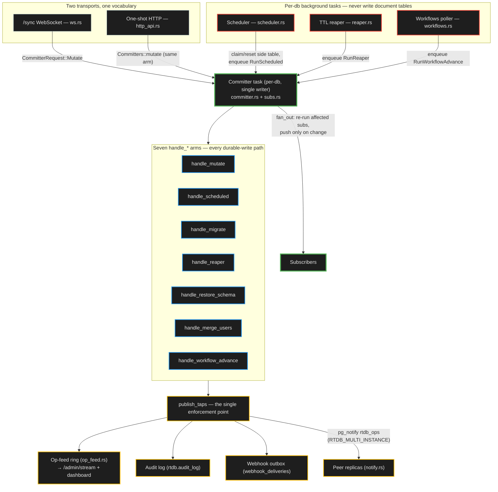
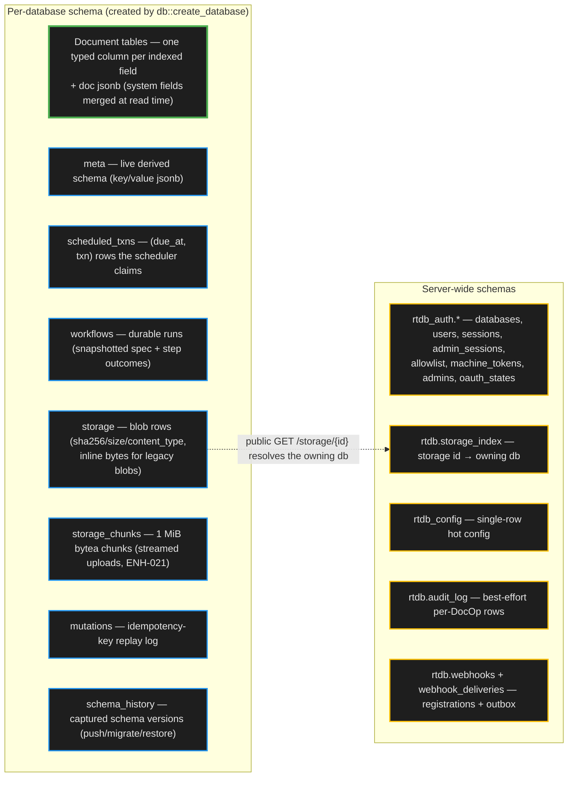

# Architecture — par-rt-db server internals

How the server is actually built: the committer, the per-database background
tasks, the data pipeline, transports, auth, storage, quotas, and the admin
surface. Written for contributors and agents changing server internals;
[`../CLAUDE.md`](../CLAUDE.md) holds the agent guidance and the invariant list,
and the root [`../README.md`](../README.md) holds the HTTP/WS surface. The main
spec
([`superpowers/specs/2026-07-21-par-rt-db-design.md`](superpowers/specs/2026-07-21-par-rt-db-design.md))
is the authoritative protocol/semantics source — when code and spec disagree,
the code wins; fix the spec.

## Table of contents

- [The single-writer committer](#the-single-writer-committer)
- [Per-database background tasks](#per-database-background-tasks)
- [Data pipeline](#data-pipeline)
- [Image transforms](#image-transforms)
- [Transports and rate limiting](#transports-and-rate-limiting)
- [Auth](#auth)
- [File storage](#file-storage)
- [Per-database resource quotas](#per-database-resource-quotas)
- [Wire contract and clients](#wire-contract-and-clients)
- [Admin surface and the op-feed tap](#admin-surface-and-the-op-feed-tap)
- [Backups and restore](#backups-and-restore)
- [Hot config and dynamic CORS](#hot-config-and-dynamic-cors)
- [Static SPA hosting](#static-spa-hosting)

## The single-writer committer

The correctness core lives in `committer.rs` + `subs.rs`. Each database has one
task that serializes all writes, then — before dequeuing the next message —
re-runs affected subscriptions, diffs against the last pushed value, and pushes
only on change. Subscription registration rides the same queue.

**This serialization is load-bearing**: `execute_txn`/`execute_query` run READ
COMMITTED with no row locking. Never call `execute_txn` outside the committer;
never add a second writer.

### Skip-invalidation classes

Invalidation skips soundly for three read-set classes (any doubt
over-approximates to re-run, so it never under-approximates):

- **`get(id)` point reads** (`subs::ReadSet::Point`) skip when the txn's
  `WriteSet.docs` doesn't contain their `(table, id)`.
- **`count`/`collect`/`unique` on a btree index's eq-prefix** (+ optional range
  bound) (`subs::ReadSet::Indexed`) skip when every written doc is provably
  outside their window — `WriteSet.doc_values` carries each written doc's
  before/after state so `fan_out` evaluates `Window::contains` per written doc
  (deleted ⇒ re-run; `count` is membership-only, `collect`/`unique` are
  content-bearing).
- **`take(N)`/`first`/`paginate`** (`subs::ReadSet::Ordered`) pair that window
  with the sort key of the last computed result's final row — the boundary —
  and skip a written doc that is outside the window or ranks beyond the
  boundary in both its before- and after-state (it can neither be in the top N
  nor displace a member, since displacement requires a member's own write). The
  boundary is seeded at registration and refreshed on every re-run; an unfull
  result (fewer than N docs, or a page with no next cursor) leaves it unset ⇒
  plain membership. Ranking needs `created_at`, which `doc_values` carries (a
  `Delete` captures none ⇒ deletes always re-run).

`distinct`/`aggregate`/`search`/`vector`/`hybrid` stay table-level by design —
their results depend on member values or a ranking function (over-approximate
freely, never under-approximate).

### Safety nets

A wrong skip is otherwise silent (no error — the client just never hears), so
two nets guard the logic:

- `cmp_binds` is structured so its outer match is exhaustive over `EqBind`,
  making a new variant a compile error instead of a `_ => None` that
  under-approximates (do not collapse it back into `match (a, b)`).
- `RTDB_SUBS_VERIFY_SKIP_EVERY` (boot, **ships ON at a 1000 sampling interval
  by default**; 0 = off) shadow-verifies 1 skip in every N by re-running the
  query anyway and diffing against the last pushed result — a divergence logs
  at ERROR, increments `rtdb_subs_missed_pushes_total`, and pushes the
  corrected result.

`fan_out` also records skip/re-run counts per read-set class
(`rtdb_subs_skips_total{class=point|indexed|ordered}`, `rtdb_subs_reruns_total`),
surfaced on the dashboard metrics page. Any non-zero `subsMissedPushesTotal` is
a correctness defect, not a tuning signal.

### Schema migrate rides the same queue

Schema migrate is a third committer request arm (`CommitterRequest::RunMigrate`,
handled by `handle_migrate`) alongside `handle_mutate`/`handle_scheduled`:
`POST /admin/db/{db}/migrate` enqueues an ordered `Directive` list and the
committer executes the DDL + DML in its serialized turn, then `fan_out`s and
publishes at the same tap sites — so the op-feed/audit/webhook "every durable
write publishes here" guarantee extends to migrate (see `migrate.rs` and the
2026-07-31 spec).

## Per-database background tasks

`Committers::channel_for` spawns the per-db task set: committer, scheduler,
TTL reaper, mutation-log cleanup, and the storage-quota cache warmer. All the
non-committer tasks follow the same rule: **they never write document
tables** — they only claim/enqueue work
back through the committer, preserving the single-writer invariant.

### Scheduler and durable workflows (`scheduler.rs`, `workflows.rs`)

The scheduler is a second per-db task, not a second writer: a timer
(`run_scheduler`) drains the `scheduled_txns` side table of
`(due_at, txn)` rows. It writes ONLY that side table (claim/reset) and enqueues
each due job as a `CommitterRequest::RunScheduled`; the committer's `RunScheduled`
arm (`handle_scheduled`) executes it via the normal `execute_txn` +
`subs.fan_out` path and finalizes the row. Delivery is at-least-once; one-shot
catches up if past due, cron skips missed windows.

**Durable declarative workflows (FM-29, `workflows.rs`)**: the same timer task
also polls the per-db `workflows` side table and enqueues each due run as a
`CommitterRequest::RunWorkflowAdvance`; the committer's arm
(`handle_workflow_advance`) executes the current step's txn via the normal
`execute_txn` + `subs.fan_out` path — steps fire as the system (bypass)
principal like scheduled jobs — records the step outcome, and applies
`StepRetry` backoff and `sleepBeforeMs` before re-arming. Still at-least-once
per step; a crash mid-advance leaves the row `running`, and scheduler startup
`reset_running` re-arms it.

**Cold-db liveness**: every workflows surface ensures the side table inline
(admin handlers + the client list/cancel arms — the table is otherwise ensured
only at scheduler startup), and all three standalone start surfaces (WS
`startWorkflow` frame, `POST /api/workflows`, admin create) call
`Committers::ensure_spawned` + `workflows::ensure_table` BEFORE insert, so a
workflow started on a cold db (no per-db tasks yet) both starts and advances.

**Task lifecycle**: the poller tasks (scheduler, mutation-log cleanup, TTL
reaper, quota warmer) self-terminate when they detect their database has been
deleted (a `db::database_exists` check on a poll error, after `DROP SCHEMA`
removes their tables), so `delete-db` (`POST /admin/delete-db`, typed
`{name, confirm}` guard) retires the per-db tasks cleanly instead of leaving
perpetual error-log spam — and dropping their channel senders lets the
reactive committer task exit too.

**Idle-database reclamation** (`RTDB_DB_IDLE_RECLAIM_SECS`, default 0 = off,
ARC-102 step 4): when non-zero, a server-wide background sweep retires a
database's five per-db tasks once it has had no client activity for that long
AND has no live subscriptions AND no pending scheduled jobs or workflows
(`scheduler::next_due` and `workflows::next_due` are both `None`) — reusing the
same evict-channel + `Shutdown` cascade as `delete-db`, so the single-writer
invariant and the pollers' `committer_tx.closed()` exit all hold. Steps 1–3
already gate each poller's per-tick work (scheduler skips `claim_due` when
nothing is due; reaper skips when no table declares a ttl; mutation-log cleanup
backs off after a zero-row sweep), so reclamation is opt-in task-slot release,
not a correctness fix; the next request respawns the tasks via `channel_for`.
A db with a live subscription, a pending cron/one-shot, or a pending workflow
is never reclaimed.

### TTL reaper (`reaper.rs`)

A third per-db task, not a third writer: a periodic reaper (`run_reaper`)
enqueues a fire-and-forget `CommitterRequest::RunReaper` every
`RTDB_TTL_SWEEP_INTERVAL_SECS` (boot, default 60). It writes NOTHING — it only
does a `database_exists` keepalive + `send(RunReaper)`. The committer's
`RunReaper` arm (`handle_reaper`) batch-deletes rows whose declared `ttl.field`
value is past (`DELETE … WHERE f_<field> < now() LIMIT RTDB_TTL_BATCH`, default
5000) inside its serialized turn, then publishes through the same tap sites as
`handle_mutate`/`handle_scheduled`/`handle_migrate` with `source = "ttl"`,
`owner = None` (system-initiated — bypasses per-row `ownerField` like scheduled
jobs). Same self-termination lifecycle (db-deletion `database_exists` check +
channel-close). Never write document tables from the reaper task — the delete
runs only in `handle_reaper` inside the committer turn.

## Data pipeline

`schema.rs` → `ddl.rs` → `txn.rs`/`query.rs`. A pushed schema compiles to
Postgres DDL — one typed column per indexed field, documents stored as `doc`
jsonb with system fields merged in at read time, schema changes additive-only.

- **Indexes**: a btree index may declare `unique` + a partial `where` predicate
  (compiles to `CREATE [UNIQUE] INDEX … [WHERE …]`); a uniqueness violation
  surfaces as the `CONFLICT` (409) error code.
- **Defaults** (FM-32): a table may declare `defaults`, a map of field name →
  literal JSON value (additive wire key, omitted when empty): push-validated
  (key is a declared field, value non-null and type-correct via the same
  `validate_value` the write path uses) and stamped onto a new document that
  omits the key — insert/replace/upsert-insert only, never
  `patch`/upsert-update/patchByQuery/snapshot replay — with the ttl
  `defaultDurationMs` stamp and the principal stamps (`ownerField`, authorize
  `$user`) winning over a defaults entry on the same field; migrate
  `renameField` re-keys the map and `dropField`/`changeType` drop entries.
- **Cascade delete + soft delete** (FM-33): an `id` field may declare
  `onDelete: cascade|restrict|setNull` (legal top-level or one `optional`
  deep) and a table may declare `softDelete` — both enforced **in the app layer
  inside `execute_txn`** (`delete_row_cascade`), deliberately NOT SQL FKs, so
  every cascaded/stamped/nulled row records its own `DocOp`/`WriteSet` entry
  (subscriptions/op-feed/audit/webhooks fire per row): the walk is
  children-first in BTreeMap order with a visited-set cycle guard, `restrict`
  conflicts naming the referencing `table.field`, `setNull` patches the child
  field to null (key removed from the doc body, version bumps), and one shared
  per-initiating-step budget (`MAX_CASCADE_ROWS`, 10_000) turns an over-budget
  cascade into a rolled-back `CONFLICT`. `Delete` on a `softDelete` table
  stamps a physical `deleted_at` column instead of removing the row (a stamped
  row never triggers further cascade — recursion stops there); every read
  terminal (incl. `get`/`search`/`vector`) composes `deleted_at IS NULL`,
  unique indexes widen their partial predicate to live rows only (and rebuild
  when the flag is added), the TTL reaper always hard-deletes (through the same
  cascade walk, `force_hard`), and an `Undelete` step (wire `undelete`,
  softDelete tables only) clears the stamp — idempotent-`Ok` on an already-live
  row, patch-shaped `DocOp`.

A `Transaction` is an ordered list of `Step`s:

- **Per-id steps**: `Insert`/`Patch`/`Replace`/`Delete`/`Undelete`/
  `ExpectVersion`/`ExpectAbsent`/`Upsert`.
- **Predicate-driven bulk steps**: `PatchByQuery{table,filter,patch,limit?}`
  and `DeleteByQuery{table,filter,limit?}` find rows matching a `FilterExpr`
  (the same predicate the read `.filter()` accepts) and act on them in one
  serialized committer turn. Row-visibility matches the read path exactly
  (`compile_scan_where` composes the client filter with the
  `ownerField`/`collaboratorsField`/`authorize` predicates), so an interactive
  caller touches only rows it could read; each affected row records a
  `DocOp`/`WriteSet` entry so subscriptions, op-feed, audit, and webhooks fire
  per row.
- **Scheduling steps**: `Schedule{when,txn}` inserts the `scheduled_txns` row
  on the open sqlx tx (atomic with the txn's writes) after a recursive
  table-allowlist check (`authorize_txn_tables`, also run at all three
  standalone enqueue surfaces), and `CancelSchedule{id}` removes a pending job
  in-txn; fire-time semantics unchanged.
- **Workflow steps** (FM-29): `StartWorkflow{spec}` inserts the per-db
  `workflows` side-table row on the open sqlx tx (atomic with the txn's writes)
  after the same recursive table-allowlist check over every step's txn
  (`authorize_spec_tables`, also run at all three standalone start surfaces: WS
  frame, `POST /api/workflows`, admin create — steps fire later as the system
  principal, so submit time is the only scoped check), and `CancelWorkflow{id}`
  flips a non-terminal run to `cancelled` in-txn.

Limits: `MAX_STEPS` (1024) bounds step count; `MAX_BY_QUERY_ROWS` (1000)
bounds rows per by-query step; `MAX_TAKE` (4096) bounds result/group counts
(scale via `paginate`, not larger collects). The `aggregate` terminal supports
`sum`/`avg`/`min`/`max`/`count` (the last counts rows, consumes no aggregate
field; grouped `count` is the count-per-group the dashboards need).

The read and write paths share index-value typing; keep them aligned.

## Image transforms

Read-time, HTTP-only (`image_transform.rs`): pure-Rust decode → resize →
re-encode over the `image` crate, served from a byte-weighted `TransformCache`
(`moka`) with a decode `Semaphore` and pixel cap. Wired into `serve_bytes` on
both `GET /storage/{id}` and `GET /api/storage/{db}/{id}`; no committer,
protocol, or WS involvement. See also [File storage](#file-storage) for the
query parameters and gating env vars.

## Transports and rate limiting

`protocol.rs`, `ws.rs`, `http_api.rs`. `ws.rs` is the reactive WebSocket
handler, `http_api.rs` is one-shot query/mutate. **Both route mutations
through `Committers::mutate`** so subscriptions fire regardless of which
transport wrote.

HTTP requests are optionally rate-limited per machine-token and per-db
(`RTDB_RATE_LIMIT_PER_TOKEN_RPM` / `RTDB_RATE_LIMIT_PER_DB_RPM`, 0 =
off/default; over-limit → 429 `RATE_LIMITED` + `Retry-After`; in-memory
fixed-window `RateLimiter` on `AppState`, checked after `authorize`; the same
limiter also covers inbound WS `Mutate`/`Subscribe` frames (after the per-op
`authorize` re-run): a denial replies with a `RATE_LIMITED` `MutateErr`/
`SubscribeErr` carrying `retryAfter` and the connection stays open; the
per-connection WS frame cap (200 msgs/10s, closes the socket) is a separate
coarse flood valve).

## Auth

`auth/`: per-database machine tokens and OAuth sessions (GitHub, Google,
GitLab, Microsoft, Apple, and generic OIDC, each optional via the
`OAuthProvider` trait). The WS handler **re-runs `authorize` on every Subscribe
and Mutate** — not just at connect — so revocation, allowlist changes, and
session expiry take effect on open connections.

### Per-row authorization

On top of the db-level gate:

- **`ownerField`** (`schema.rs`, enforced in `query.rs`/`txn.rs`/`subs.rs`): an
  authenticated user reads/mutates only rows they own, or rows that list them
  in a declared `collaboratorsField` (an optional array-of-strings field) —
  owner OR collaborator (inserts are server-stamped; `patch`/`replace`/
  `delete`/`upsert`-update pre-check ownership inside the serialized txn →
  `Forbidden`/403; subscriptions re-filter to the subscriber's owner on every
  `fan_out`).
- **`authorize`** (a `FilterExpr` predicate over doc fields plus
  `$user`/`$email` principal markers; design at
  [`superpowers/specs/2026-08-02-per-row-auth-predicate-dsl-design.md`](superpowers/specs/2026-08-02-per-row-auth-predicate-dsl-design.md))
  generalizes this to any declarable rule, enforced on reads (silent filter),
  writes (pre-check + auto-stamp of `$user` fields + post-write verify →
  `Forbidden`/403, atomic — on all five write paths for `ownerField` parity),
  and subscription re-runs; the `FilterExpr` `Not`/`Contains`/`Exists` variants
  it adds are also available in client `.filter()`, while principal markers
  are valid only in `authorize`.

Machine tokens and scheduled jobs (no interactive principal) bypass per-row
rules; the db-level allowlist/token/session gate still runs first.

### OAuth login flow

The OAuth login popup opens with `noopener,noreferrer` (reverse-tabnabbing
defense, SEC-012); completion is relayed by the parent polling
`GET /auth/state?state=` keyed on the single-use state token minted by
`GET /auth/{provider}/begin` (not `window.opener.postMessage`, which
`noopener` severs) — the callback sets the HttpOnly session cookie and closes
the popup without interpolating the parent origin. The poll is keyed on the
state token plus the `SameSite=None` `rtdb-oauth-state` cookie set at `/begin`
(SEC-121 — constant-time-compared to the `state` param, so a leaked state URL
alone cannot poll), which is what lets the flow work cross-origin where the
`SameSite=Lax` session cookie would not be sent. Login-CSRF is defended by a
double-submit nonce cookie (`rtdb-oauth-csrf`, value = the `state` token;
`SameSite=None;HttpOnly`, 10-min) set at `/begin` and constant-time-verified at
`/callback` (disable via `RTDB_OAUTH_LOGIN_CSRF=false`); the CORS layer sets
`Access-Control-Allow-Credentials` so cross-origin SDK consumers can store it,
and the ts-client sends `credentials:"include"` on `/begin`.

### Anonymous auth and the anon→real merge

**Anonymous auth** (`POST /auth/anonymous`, gated
`RTDB_AUTH_ANONYMOUS_ENABLED` default off, plus a per-db toggle —
`GET|PATCH /admin/db/{db}/anonymous-access`, SEC-103 — that must also allow
it): mints an ephemeral `rtdb_auth.users` row (`anonymous = TRUE`, no email) +
session, returning the session token in the body and setting the same HttpOnly
cookie as OAuth. An anonymous user is a `Principal::User` with
`anonymous = true` and `email = None` — `authorize` bypasses the per-db
allowlist for it (the boot gate is its authorization), and per-row
`ownerField` stamps its `user_id` so it owns its own drafts/cursors.

The anon→real merge on a later OAuth sign-in is shipped (FM-27): `/begin`
resolves the caller's anon session server-side (never caller-supplied) into
`oauth_states.anon_user_id`, and the callback merges synchronously via
`merge::merge_users` — per-database principal-bearing doc restamps each inside
that db's committer turn (`CommitterRequest::RunMergeUsers`, op-feed/audit/
webhook taps with `source = "merge"`), storage blob owner swap, session
re-point (an open WS or stored SDK token promotes to the real principal on its
next op), then a guarded anon-row delete; every step is idempotent, and any
interruption is recovered by signing in again. `POST /admin/merge-users` (typed
confirm, 404 on a missing anon row) runs the merge synchronously as the
operator escape hatch; `rtdb_merge_docs_total` counts restamped docs. Spec:
[`superpowers/specs/2026-08-14-anon-merge-design.md`](superpowers/specs/2026-08-14-anon-merge-design.md).
ts-client exposes it as `useRtDbAuth().signInAnonymous()`; rust/python clients
are machine-side and out of scope. See FEATURE_MATRIX #20.

### Active session management

`admin/sessions.rs`, part of the FEATURE_MATRIX Admin control plane row:
`GET /admin/sessions` lists every live interactive session
(OAuth/anonymous/admin-key); `DELETE /admin/sessions` (by `user`) and
`DELETE /admin/sessions/{token_hash}` (by single session) revoke — and because
`authorize` re-runs on every Subscribe/Mutate, revocation takes effect on the
**next op** over an already-open connection (no force-disconnect needed, no
stale-auth window). The admin dashboard mirrors this at `/sessions`;
`list_sessions`/`revoke_session`/`revoke_user_sessions` mirror into all three
client SDKs and the `rtdb sessions list|revoke` CLI.

## File storage

HTTP-only and bypasses the committer (`storage.rs`, `http_api.rs`): per-db
`bytea` blobs in a `storage` side table — streamed uploads (ENH-021) land as
1 MiB chunks in a companion `storage_chunks` table with the `storage` row's
`bytes` left NULL; legacy blobs keep inline bytes, and reads probe chunks
first — plus a global `rtdb.storage_index(id →
db)` for opaque public-serve resolution. Upload (`POST /api/storage/{db}`) and
the authed routes carry `{db}` in the path (raw bodies can't carry it; session
principals aren't db-scoped) and reuse the `bearer → resolve_bearer →
authorize` triple. **`GET /storage/{id}` is the one unauthenticated route**
(public bearer URL, Convex parity). Storage writes via `storage::put`
directly — never the committer — because blobs don't touch document tables or
subscriptions.

- **On-the-fly image transforms** (ENH-014, `image_transform.rs`) are a
  READ-TIME capability on both serve routes
  (`?w=&h=&fit=cover|contain|scale-down&q=&format=jpeg|png|auto`), gated by
  `RTDB_IMAGE_*` boot config (`RTDB_IMAGE_TRANSFORMS_ENABLED` kill switch,
  `RTDB_IMAGE_MAX_DIM`/`RTDB_IMAGE_MAX_PIXELS` decode caps,
  `RTDB_IMAGE_CACHE_BYTES`, `RTDB_IMAGE_CONCURRENCY`,
  `RTDB_IMAGE_DEFAULT_QUALITY`); a request with no transform params is a
  zero-overhead passthrough, a transformed response carries
  `Cache-Control: public, max-age=31536000, immutable`.
- **Signed, time-limited URLs** (ENH-017) are an additive capability on that
  public route: when `?exp=&sig=` are present the route HMAC-verifies (key
  derived from `admin_key`) and enforces expiry (403 on failure); absent,
  behavior is unchanged. A bearer-authorized
  `GET /api/storage/{db}/{id}/signed-url` mints them.
- **HTTP `Range` requests** (ENH-016, `serve_bytes` in `http_api.rs`):
  `Range: bytes=...` → `206 Partial Content` with `Content-Range`/
  `Content-Length` + `Accept-Ranges: bytes`; out-of-bounds → `416 Range Not
  Satisfiable`; no/ignored range → `200` full body. Single-range only
  (multipart/non-`bytes`/malformed ranges are ignored per RFC 7233); Range is
  skipped for on-the-fly image transforms (cache-keyed whole renders).

## Per-database resource quotas

ENH-011, `quota.rs`: three optional **global** caps on `HotConfig` —
`maxTablesPerDb`, `maxStorageBytesPerDb`, `maxSubsPerDb` (all `0` =
unlimited, default off) — enforced **hard** so one db cannot crowd the rest on
a shared instance.

- **Tables**: `SchemaDef::check_table_quota` at the admin push-schema handler
  + `handle_migrate` (**not** in `ddl::push_schema`, which the test harness's
  `fresh_db` calls regardless of caps).
- **Subs**: `SubscriptionManager::count_for_db` checked in
  `handle_subscribe` before `register` (`SubscribeErr`, connection stays
  open).
- **Storage**: a per-db usage cache (`quota::UsageCache`,
  `Arc<RwLock<HashMap>>` on `AppState` + cloned into `CommitterCtx`) measured
  by a `SUM(pg_total_relation_size)` query (heap + indexes + TOAST + the
  `storage` blob table; framework side-tables `meta`/`mutations`/
  `scheduled_txns`/`schema_history` excluded; `RTDB_QUOTA_CACHE_TTL_SECS`
  default 60 doubles as the warmer interval). Enforced at
  `handle_mutate`/`handle_scheduled`/`handle_migrate` entry before
  `execute_txn` (so an over-cap write commits nothing partial) as a **cheap
  stale-read** — `enforce` uses any cached reading (fresh *or* stale) and runs
  **no** `pg_total_relation_size` scan on the serialized committer turn; the
  only inline measure is a one-time cold start before the cache is seeded
  (ARC-004). A per-db background warmer task (`run_quota_warmer`, spawned
  alongside the committer/scheduler/reaper/cleanup, self-terminating on db
  removal) plus a best-effort `tokio::spawn` post-commit/post-put refresh
  keep the reading current — both are fire-and-forget, never block the client
  or the committer turn, and only re-measure + write the cache (never a
  document write); the warmer skips its tick entirely when no storage cap is
  configured (default off). The `upload_handler` path uses `current_usage`
  (TTL-bounded, measure-on-miss) for the exact `used + blob > cap` figure
  since it is per-HTTP-request, not the serialized committer. `delete-db`
  evicts the entry.

**No admin bypass** — `PrincipalCtx` cannot distinguish admin from a machine
token at the committer (both arrive as `PrincipalCtx::bypass()`,
`user_id == None`), so quotas apply uniformly to every principal; raise the
cap via `PATCH /admin/config` (instant, no restart) for a large op. A
scheduled job over the storage cap is `mark_error`'d (terminal — a config
constraint won't clear on retry). Over-cap is `QUOTA_EXCEEDED` (HTTP 507);
metric `rtdb_quota_rejections_total{kind=tables|storage|subs}` with a per-db
breakdown on the `/admin/metrics` JSON only (never the Prometheus scrape —
per-db labels would blow up cardinality). `db_stats` exposes quota+usage;
mirrored across all four clients (`HotConfig`/`HotConfigPatch` +
`QUOTA_EXCEEDED`).

## Wire contract and clients

`server/src/protocol.rs`, `ts-client/src/protocol.ts`,
`rust-client/src/wire.rs`, and `python-client/src/par_rt_db/wire.py` are four
implementations of the same protocol and must stay byte-identical (serde tags
and field names). The casing is deliberately non-uniform and load-bearing —
match the protocol files exactly (see the spec). The SDKs are no-codegen: a
schema object is both pushed to the server and the source of inferred types.
The Rust client ports the TS SDK (design at
[`superpowers/specs/2026-07-22-rust-client-design.md`](superpowers/specs/2026-07-22-rust-client-design.md));
its `http`, reactive `ws`, and `admin` features all ship, plus
index/`mutate_with_retry` helpers and `.filter()`/`.search()` builders. The
Python client ships the wire contract and schema/mutation/query DSL today
(design at
[`superpowers/specs/2026-07-25-python-client-design.md`](superpowers/specs/2026-07-25-python-client-design.md));
its HTTP/admin/storage surfaces ship (a sync `httpx` client —
`pip install par-rt-db[http]`), as does the reactive `ws` surface
(`RtDbClient` async over `/sync` — `pip install par-rt-db[ws]`; live
`subscribe` + at-most-once `mutate` + schedule ops), optimistic updates, and
an in-memory test harness — the four clients are now at feature parity.
`FEATURE_MATRIX.md` tracks parity vs. Convex.

## Admin surface and the op-feed tap

### The publish_taps enforcement point

Durable document mutations publish through the committer's single enforcement
point — the `publish_taps` helper (ARC-001, `committer.rs`) — called from
**seven** `handle_*` arms: `handle_mutate`, `handle_scheduled`,
`handle_migrate`, `handle_reaper`, `handle_restore_schema`,
`handle_merge_users` (the anon→real merge's committed doc restamps,
`source = "merge"`), and `handle_workflow_advance` (durable workflow step
commits, `source = "workflow"`). Any future code path that commits a document
txn must call `publish_taps` too, or the op-feed (and `/admin/stream`) will
silently miss those writes. TTL deletes are durable writes the same way
(`handle_reaper`, `source = "ttl"`, `owner = None`) — add new tap sites to
this list.

- **`/admin/stream` auth**: the WS upgrade gate accepts the admin bearer from
  the `Authorization` header (CLI/automation) **or** the
  `Sec-WebSocket-Protocol: rtdb-admin.<token>` subprotocol (the browser
  dashboard — browsers can't set headers on a WS handshake); both funnel
  through `authenticate_admin` (`admin/mod.rs`), preserving the constant-time
  admin-key compare and the OAuth-admin-allowlist check.
- **Durable audit log**: when `RTDB_AUDIT_LOG_ENABLED` (boot, default off) is
  set, `publish_taps` best-effort writes one `rtdb.audit_log` row per `DocOp`
  (`ts_ms, db, table, op, doc_id, principal=owner, source`) — so the audit
  trail inherits the op-feed's "every durable write publishes here" guarantee;
  the table is ensured at boot only when enabled, and
  `GET /admin/audit?db=&limit=&offset=` reads it (empty when disabled).
- **Webhook/event delivery**: when `RTDB_WEBHOOKS_ENABLED` (boot, default off)
  is set, `publish_taps` enqueues one `rtdb.webhook_deliveries` (outbox) row
  per matching `DocOp` (per `rtdb.webhooks` row filtered by db/table/events),
  and a boot worker drains the outbox via reqwest POSTs with exponential
  backoff (at-least-once); admin CRUD at `/admin/db/{db}/webhooks`.

### Admin document access

`admin/docs.rs`, `ws.rs`: a dashboard admin reads/writes documents across
every database via `POST /admin/db/{db}/query|mutate` (`owner=None`,
bypassing per-row `ownerField`) and over `/sync`, where an admin (`is_admin`
at the handshake) bypasses the per-db `authorize` and subscribes/mutates with
`owner=None`. Machine tokens and non-admins are unchanged;
`auth::authorize`/`owner_of` are untouched.

The admin-only `RTDB_MAX_AFFECTED_DOCS` (boot `Config`, default 100)
step-count cap rejects an over-cap mutation before the committer — an
over-cap write never becomes durable. The step-count cap bounds the per-id
steps (`Insert`/`Patch`/`Replace`/`Delete`/`Undelete`/`Upsert`, each ≤1 doc,
so `steps.len() ≤ cap` ⟹ affected ≤ cap); the predicate-driven
`PatchByQuery`/`DeleteByQuery` steps are ONE step each but touch many rows, so
they bypass the step-count cap and are bounded instead by a per-step row cap
(`MAX_BY_QUERY_ROWS`, const default 1000) enforced inside `execute_txn` — a
step whose match set exceeds its `limit` touches exactly `limit` and reports
`truncated: true`. The admin query route also accepts `includeDeleted: true`
(an internal `execute_query` param, NOT a wire `Query` field) so an operator
can see soft-deleted rows.

## Backups and restore

`backup.rs`, `admin/backups.rs`. The manual `POST /admin/backup` trigger
spawns one `pg_dump` **outside the committer** (a read — same as the cron
task) and is gated by an `AppState` `backup_running` flag (a second call while
running → 409). `POST /admin/restore` restores a dump into a **fresh
`rtdb_restored_<stamp>` Postgres DB** via `createdb` + `pg_restore
--no-owner --no-privileges` — the live `rtdb` DB is never touched, so the
single-writer invariant is preserved and there are no locks/races. An existing
target of the same name is pre-dropped (the name is `rtdb_restored_`-scoped,
never the live DB), so retrying the same dump is an idempotent
drop-and-recreate; when the drop cannot run (a connection still open on the
target), the route 409s naming the manual recovery step.
`GET|DELETE /admin/backups/{name}` download/delete a dump; all name-bearing
routes pass `backup::validate_dump_name` (path-traversal guard). Restore
requires a typed `confirm == name`. **`CREATEDB` privilege** is required on
the DB role (new — the server previously only ran `CREATE SCHEMA`/
`CREATE EXTENSION`). Credentials travel via `PG*` env, never argv.

## Hot config and dynamic CORS

`config.rs`, `lib.rs`. Seven settings — `allowed_origins`, `session_ttl_days`,
`max_file_size`, `idempotency_ttl_ms`, plus the three ENH-011 quota caps
(`maxTablesPerDb`/`maxStorageBytesPerDb`/`maxSubsPerDb`) — are
runtime-mutable, held on `AppState` as `Arc<ArcSwap<HotConfig>>` and
persisted in a single-row
`rtdb_config` table (boot seeds from env when no row exists; a malformed row
warns and falls back to env rather than blocking startup). Every consumer
reads `state.hot.load()` (the committer reads `idempotency_ttl_ms` live at
mutate-dedup time via the same shared `Arc`); `PATCH /admin/config` validates
+ persists + swaps live (no restart). The `CorsLayer` is built once but its
origin check is an `AllowOrigin::predicate` that re-reads live
`allowed_origins` per request. `GET /admin/config` is structurally redacted —
`admin_key`, OAuth secrets, and `database_url` are configured-bools, never
values.

## Static SPA hosting

`lib.rs`. When `RTDB_STATIC_DIR` (boot `Config`, `Option<String>`) is set and
the dir exists, a `tower-http` `ServeDir` (with a `ServeFile` `index.html`
SPA fallback) is mounted as the router's **last** `fallback_service` — it only
handles paths no registered route matches, so it can never shadow `/healthz`,
`/privacy`, `/metrics`, `/api/*`, `/admin/*`, `/sync`, or `/auth/*`
(`/metrics` is content-negotiated: a browser `Accept: text/html` is served the
SPA `index.html`, any other client gets Prometheus text exposition — see
`prometheus_metrics_handler`). Unset/empty/non-existent dir ⇒ API-only.

A `from_fn` middleware sets `Cache-Control` from the response `Content-Type`
(text/html → no-cache so a new deploy's index.html is always fetched;
everything else → immutable) and wraps only the `ServeDir`, never the API
routes. Same-origin ⇒ the dashboard needs no `allowed_origins` entry. In the
docker deploy the SPA is **baked into the image** (the `dashboard` build stage
in `Dockerfile` runs the bun/vite build and copies `dist/` to
`/app/dashboard-dist`, which `RTDB_STATIC_DIR` points at) — so a frontend
change ships via the standard `docker compose up -d --build` (image rebuild +
server container recreate); it is not a live-mounted volume.
