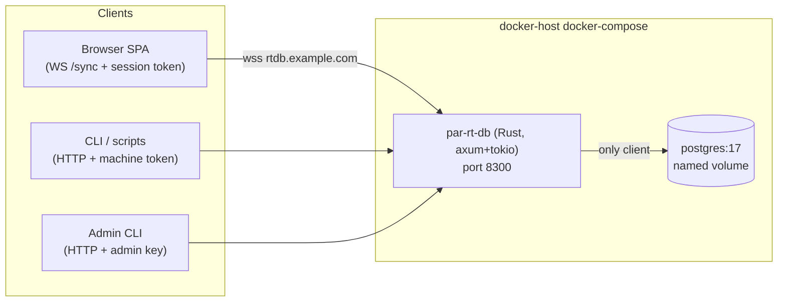

# par-rt-db — Self-Hosted Realtime Document DB (Design Spec)

**Date:** 2026-07-21
**Status:** Implemented — server is live at `rtdb.example.com`. See `FEATURE_MATRIX.md` §1 ("At parity today") and §2 (ranked gap matrix, all 26 rows ✅). Originally scoped as MVP-only; every "out of scope" item below has since shipped as a follow-on spec. Authoritative current source of truth: the code (`server/src/`, `ts-client/`, `rust-client/`, `python-client/`) and `FEATURE_MATRIX.md`, not this document.
**Repo:** `~/Repos/par-rt-db`

## Purpose

A self-hosted, Convex-inspired realtime document database written in Rust, deployed in
Docker on docker-host. It replaces Convex cloud for Paul's personal projects. The MVP feature
set is exactly the set of Convex capabilities the kanban board (`~/Repos/projects`,
projects.example.com) actually uses — inventoried from source, not guessed.

The kanban app port itself is a **separate follow-up project** with its own spec/plan.
This spec covers the server, the TypeScript client, and deployment.

## Decisions (settled during brainstorming)

| Decision | Choice | Rationale |
|---|---|---|
| Compatibility | Convex-inspired, own protocol | Drop-in Convex compat would require embedding V8 to run TS server functions; not worth it. |
| Function model | Declarative query/transaction DSL sent by the client | No per-app server code, no JS runtime, one generic server serves every app. |
| Tenancy | One instance, many named databases | New projects create a database, not a deployment. |
| Exposure | Public at `rtdb.example.com` via Cloudflare tunnel → Traefik | Browser SPAs connect directly, like Convex. |
| User auth | Built-in GitHub OAuth + per-database email allowlist | Kanban is a public SPA — static keys would be exposed. Matches today's Convex Auth + `ALLOWED_EMAILS` model exactly. |
| Machine auth | Per-database bearer tokens (constant-time compare) | CLI/scanner/importer run on trusted hosts; replaces the kanban `/agent` + `AGENT_TOKEN` pattern. |
| Storage | **Postgres 17 sidecar** (user's call; SQLite was the presented recommendation) | Battle-tested durability, JSONB, room to grow. par-rt-db is Postgres's only client, so no LISTEN/NOTIFY is needed — invalidation happens in-process after commit. |

## MVP feature set (from the kanban inventory)

**In scope:**
- Schema with typed validators: `string, number, boolean, null, id, optional, union,
  literal, array, object`; secondary indexes including compound indexes.
- Query surface: `withIndex` with chained `eq` on index fields, `order asc|desc`,
  `take(n)`, `unique()`, `collect()`, point `get(id)`.
- Mutations as atomic multi-step transactions: `insert`, `patch`, `delete`,
  preconditions, `upsert` sugar.
- Realtime: live query subscriptions over WebSocket; push-on-change only.
- HTTP one-shot query/mutate for machine callers.
- Built-in GitHub OAuth, sessions, per-database email allowlist.
- End-to-end TypeScript types with **no codegen** (schema is TS; types are inferred).

**Explicitly out of scope at MVP time (unused by the kanban app):** actions,
file storage, scheduler, cron jobs, pagination, db-side `.filter()`, `.first()`,
`.replace()`, text/vector search, optimistic updates, per-row authorization
rules. **All but "actions" and "optimistic updates" have since shipped** — see
the follow-on specs indexed in `docs/superpowers/SPEC_STATUS.md`:

- file storage → FEATURE_MATRIX #16 (spec `2026-07-23-file-storage-design.md`)
- scheduler + cron → FEATURE_MATRIX #9 / #10 (spec `2026-07-23-scheduled-cron-transactions-design.md`)
- pagination → FEATURE_MATRIX #5
- db-side `.filter()` → FEATURE_MATRIX #15
- `.first()` → FEATURE_MATRIX #2 · `.replace()` → FEATURE_MATRIX #6
- text search → FEATURE_MATRIX #11 · vector search → FEATURE_MATRIX #17 (spec `2026-07-23-vector-search-design.md`)
- per-row authorization → FEATURE_MATRIX #20 (spec `2026-07-24-per-row-authorization-design.md`)
- optimistic updates → FEATURE_MATRIX #12 (shipped in all three client SDKs: ts-client + rust-client + python-client)
- actions → 🚫 deliberate non-goal (no embedded JS runtime, no per-app server code; see FEATURE_MATRIX §3)

Expected scale: low thousands of rows per database, a handful of concurrent
subscriptions, sparse writes. Design choices below deliberately exploit this.

## Architecture



Single Rust process. Per named database: one **committer task** that serializes all
writes, executes each transaction inside a Postgres transaction, then drives
subscription invalidation. Reads (queries) go straight to Postgres concurrently.

### Postgres layout

- One Postgres schema per rt-db database: `db_<name>`.
- On schema push, the server diffs and runs DDL. Each user table becomes a real table:
  `id text primary key` (generated doc id), `doc jsonb` (full document),
  `created_at bigint` (the `_creationTime` equivalent), `version bigint`
  (bumped on every write; drives preconditions), plus **one real typed column per
  indexed field**, kept in sync with `doc` on write. Each declared index becomes a real
  Postgres btree index over those columns (compound indexes included, with `created_at`
  as the implicit tiebreaker, matching Convex ordering semantics).
- A `meta` table per database stores the current schema JSON and schema version.
- A global `rtdb_auth` schema holds `users`, `sessions`, and per-database
  `allowlist` + `machine_tokens` tables.

Schema migration policy: additive changes (new tables, new optional fields, new
indexes) apply automatically on push. Destructive/type-changing transformations
(rename, type coercion, removal, default backfill, and a scoped arbitrary-transform
escape) are applied via the declarative migrate operation
(`POST /admin/db/{db}/migrate`) — see
`docs/superpowers/specs/2026-07-31-schema-migration-backfill-design.md`.

## Wire protocol

Two transports, one operation vocabulary. All payloads JSON.

### WebSocket `/sync` (browsers)

Client → server: `auth {sessionToken, db}`, `subscribe {queryId, query}`,
`unsubscribe {queryId}`, `mutate {mutId, txn}`, `ping`.
Server → client: `authOk {user}`, `authErr`, `queryUpdate {queryId, result}`
(sent on subscribe and on every change), `mutateOk {mutId, result}`,
`mutateErr {mutId, error}`, `pong`.

Connection rules: 64 KiB message cap (raised from the original 16 KiB to match axum/tungstenite's
frame-size enforcement point; amended after Task 9 review), heartbeat with idle reaping,
per-session rate limit, auto-reconnect handled client-side with resubscribe of all active queries.

### HTTP (machines + control plane)

- `POST /api/query`, `POST /api/mutate` — one-shot, `Authorization: Bearer <machine token>`,
  `X-RtDb-Database: <name>` (or in body). Same query/txn payloads as the WS transport.
- `GET /auth/github` → GitHub OAuth redirect; `GET /auth/callback` → popup callback page
  that `postMessage`s the session token to the opener; `POST /auth/logout`.
- `POST /admin/*` (admin key): `create-db`, `push-schema`, `mint-token`, `revoke-token`,
  `allowlist add|remove|list`, `list-dbs`.
- `GET /healthz`.

### Query DSL

```json
{
  "table": "workItems",
  "index": "by_project_and_status",
  "eq": ["<projectId>", "in_progress"],
  "order": "desc",
  "take": 500
}
```

Semantics mirror Convex exactly: `eq` values bind index fields left-to-right (prefix
allowed), `order` sorts by the remaining index fields then `created_at`, terminal is
one of `take(n)`, `unique` (error if >1 match), or `collect`. Point reads:
`{"get": "<id>"}`. No general filter expressions in MVP.

### Transaction DSL

A mutation is an ordered list of steps executed all-or-nothing:

- `insert {table, doc}` → returns generated id
- `patch {id, fields}` (error if doc missing)
- `delete {id}`
- `expectVersion {id, version}` — precondition; fails txn with `PRECONDITION_FAILED`
- `expectAbsent {table, index, eq}` — precondition
- `upsert {table, index, eq, insert, patch}` — sugar: patch the unique match or insert

Read-compute-write flows (e.g. kanban `reorder`, `mergeProject`): client queries,
computes, submits a txn guarded by `expectVersion`; the client SDK offers a bounded
retry helper for `PRECONDITION_FAILED`. Because all writes per database are serialized
through the committer, there is no other conflict mode.

Every step is validated against the pushed schema (`SCHEMA_VIOLATION` on mismatch)
before the Postgres transaction begins.

## Reactivity

After each committed transaction the committer:
1. Knows the write-set (set of tables touched).
2. Re-runs every active subscription on that database whose query tables intersect
   the write-set.
3. Diffs each result against the last pushed result (canonical JSON compare).
4. Pushes `queryUpdate` only when changed.

Invalidation granularity is **table-level** — deliberately coarse and provably correct.
At MVP scale re-running a handful of indexed `take(500)` queries per write is
microseconds of Postgres work. Fine-grained read-set/range tracking is a contained
future upgrade inside the subscription manager, not a protocol change.

Client semantics match Convex: `useQuery` returns `undefined` until the first
`queryUpdate`; the `"skip"` sentinel suppresses subscription entirely.

## Auth

- **Users:** GitHub OAuth code flow implemented by the server (one GitHub OAuth app for
  the whole instance). Popup flow: SPA opens `/auth/github`, the callback page posts the
  session token to `window.opener` (allowed origins configured per instance), SPA stores
  it and presents it in the WS `auth` message. Sessions are rows in `rtdb_auth.sessions`
  with expiry; tokens are opaque 256-bit random values, constant-time compared.
- **Authorization model:** per-database email allowlist, enforced server-side on every
  connection and every operation. An allowlisted user has full read/write on that
  database. No per-row rules in MVP (the kanban app has none today).
- **Machines:** per-database bearer tokens minted by admin CLI, stored hashed,
  constant-time compared. Full read/write on their database.
- **Admin:** single `RTDB_ADMIN_KEY` env var gates `/admin/*`.
- Never auto-generate or rotate secrets silently; all key material is created explicitly
  via admin commands and surfaced once.
- **Login CSRF (resolved 2026-08-02; see `2026-08-02-login-csrf-hardening-design.md`):** the OAuth `state` token is bound to the
  initiating *origin* — the callback page's `postMessage` target-origin is pinned to the
  origin validated at `/auth/github?origin=`, so a malicious page cannot receive the
  session token even if it can trigger the flow — but it is not bound to the initiating
  *browser* (no PKCE, no state cookie). An attacker who completes their own GitHub OAuth
  exchange and then gets a victim's browser to load the resulting callback at an allowed
  origin could have the victim's SPA receive and store the attacker's session token via
  `postMessage` — logging the victim in as the attacker, not compromising the victim's
  own account. **Resolved 2026-08-02:** a double-submit nonce cookie (`rtdb-oauth-csrf`,
  value = `state`) now binds `state` to the initiating browser — set at `/begin`,
  constant-time-verified at `/callback`, default-on with break-glass
  `RTDB_OAUTH_LOGIN_CSRF=false`. The text above is retained as the pre-hardening
  historical record.

## TypeScript client (`client/` package)

- Schema builder with Convex-style ergonomics:
  `defineSchema({ projects: defineTable({ name: t.string(), status: t.union(t.literal("active"), ...) }).index("by_name", ["name"]) })`.
  The same TS schema object is (a) pushed to the server as JSON by the CLI and
  (b) the source of inferred types — **no codegen step**.
- `RtDbClient`: WebSocket client with auto-reconnect (randomized exponential backoff),
  automatic re-auth + resubscribe, heartbeat.
- React bindings: `useQuery(schema.workItems.query(...) | "skip")` → `T | undefined`,
  `useMutation()` returning a typed txn submitter; `RtDbProvider`; auth helpers
  (`signInWithGitHub()`, `signOut()`, `Authenticated/Unauthenticated/AuthLoading`
  equivalents).
- `RtDbHttpClient` for Node CLIs (one-shot query/mutate with machine token).
- Typed error class `RtDbError { code, message }`.

## Error handling

Single envelope on both transports: `{code, message}` with codes
`UNAUTHORIZED, FORBIDDEN, NOT_FOUND, SCHEMA_VIOLATION, PRECONDITION_FAILED,
BAD_REQUEST, INTERNAL`. WS auth failures also close with a distinct close code so the
client knows not to blind-retry. Mutations are never auto-retried by the SDK except via
the explicit precondition retry helper. Server: graceful shutdown via
`CancellationToken` + `TaskTracker`, structured `tracing` logs, bounded queues
everywhere.

## Testing

- **Rust integration tests against real Postgres** (docker-compose test profile,
  loopback port 55434): schema push → DDL correctness; query DSL → SQL semantics
  (order/take/unique/compound-index prefix); transaction atomicity + precondition
  failures; auth (allowlist, token, session expiry); and subscription correctness —
  write → exactly the right `queryUpdate`s, no spurious pushes, correct behavior across
  reconnect.
- **TS client:** vitest integration suite against a locally running server; type-level
  tests asserting schema→hook inference.
- **Acceptance (post-port, separate project):** kanban web + CLI + scanner running
  against par-rt-db on docker-host with GitHub sign-in and live board updates.
- Makefile with standard targets (`build test lint fmt typecheck checkall`) covering
  both the Rust crate and the TS package; pre-commit with gitleaks before first push.

## Deployment

- Multi-stage Dockerfile (musl or debian-slim runtime). docker-compose stack on docker-host:
  `par-rt-db` (port 8300) + `postgres:17` + named volume; Traefik labels and Cloudflare
  tunnel ingress for `rtdb.example.com` per the par-infra patterns (remember `$$`
  escaping in compose env vars).
- Nightly `pg_dump` to the host backup path.
- Ports reserved in `~/.claude/used_ports.md`: **8300** (server), **55434** (dev/test
  Postgres loopback).

## Success criteria (this project)

1. `make checkall` green (Rust + TS).
2. A demo app exercising every MVP feature runs against a local compose stack.
3. Deployed on docker-host, reachable at `rtdb.example.com`, GitHub sign-in works, live
   updates propagate between two browser tabs and from an HTTP machine write.

## Future (explicitly deferred at MVP time; current status marked inline)

- Fine-grained subscription invalidation → FEATURE_MATRIX #21 (**shipped** through v3: point-read skip, eq-prefix/range windows, and ordered top-N boundaries; spec `2026-07-24-fine-grained-subscription-invalidation-design.md`)
- pagination → **shipped** (FEATURE_MATRIX #5)
- db-side filters → **shipped** (FEATURE_MATRIX #15)
- scheduler/crons → **shipped** (FEATURE_MATRIX #9 / #10)
- file storage → **shipped** (FEATURE_MATRIX #16)
- per-row authorization → **shipped** (FEATURE_MATRIX #20)
- additional OAuth providers → **shipped**: GitHub + Google (FEATURE_MATRIX #14)
- multi-node → 🚫 deliberate non-goal (single-node Postgres; see FEATURE_MATRIX §3)
